# Architekturüberblick 0 A.D "Arc42"

0 A.D. ist ein freies, open-source Echtzeit-Strategiespiel, das von Wildfire Games entwickelt wird.
Es simuliert historische Zivilisationen und kombiniert den Aufbau von Städten, das Sammeln von Ressourcen und taktische Schlachten in einer antiken Welt.

Dieser Architekturüberblick beschreibt die grundlegenden Konzepte und Entwurfsentscheidungen des Projekts. Er zeigt die Struktur der Software, das Zusammenspiel der zentralen Komponenten und die Prinzipien, auf denen die Architektur von 0 A.D. basiert.Die Gliederung folgt der arc42-Vorlage.

Zielgruppe dieses Überblicks sind Softwarearchitektinnen und -architekten, Studierende sowie Entwicklerinnen und Entwickler, die die modulare, erweiterbare Architektur von 0 A.D. nachzuvollziehen möchten.


# 1 Einführung und Ziele 

Dieser Abschnitt führt in die Aufgabenstellung ein und erklärt, welche Ziele 0 A.D. verfolgt.

## 1.1 Aufgabenstellung 

- 0 A.D. verbindet historische Geschichte mit strategischem Gameplay
- Spielende übernehmen die Kontrolle über historische Zivilisationen, errichten Städte, verwalten Ressourcen und führen strategische Schlachten.  
- Ziel des Projekts ist ein frei zugängliches Strategiespiel, das gemeinschaftlich entwickelt wird und historische Inhalte mit spielerischem Anspruch verbindet. 
- Das Spiel richtet sich an Gelegenheitsspielende ebenso wie an Personen, die sich für Geschichte, Strategie und offene Entwicklungsprojekte interessieren.  
- 0 A.D. wird von einer aktiven Community gepflegt und kontinuierlich weiterentwickelt.

## 1.2 Qualitätsziele 

Die folgende Tabelle fasst die wichtigsten Qualitätsziele von 0 A.D. zusammen. Die Reihenfolge dient dabei als grobe Orientierung für ihre Bedeutung in der Architektur.

| **Qualitätsziel** | **Motivation und Erläuterung** |
|----------------|-----------------------------|
| Erweiterbarkeit / Modding-Freundlichkeit | 0 A.D. soll leicht um neue Zivilisationen, Karten und Spielmechaniken erweitert werden. Eine offene Modding-Struktur ist Kern der Projektphilosophie und fördert langfristige Community-Beteiligung. |
|  Leistungseffizienz | Das Spiel muss auch bei großen Karten und vielen Einheiten flüssig laufen. Hohe Effizienz prägt Engine-Design und Simulation. |
|  Wartbarkeit  | Der Quellcode soll für freiwillige Entwickler:innen klar strukturiert, dokumentiert und leicht anpassbar bleiben. |
|  Portabilität | 0 A.D. soll auf allen wichtigen Betriebssystemen (Windows, Linux, macOS) lauffähig sein, um eine breite Nutzerbasis zu erreichen. |
|  Multiplayer-Zuverlässigkeit | Sowohl Einzel- als auch Mehrspieler-Modus sollen zuverlässig funktionieren; deterministische Simulation verhindert Desynchronisation. |

## 1.3 Stakeholder

Dieser Abschnitt beschreibt die wichtigsten Interessengruppen von 0 A.D.  
Jede Gruppe hat ein spezifisches Interesse und einen unterschiedlichen Bezug zur Softwarearchitektur.

| **Wer?** | **Interesse und Bezug** |
|------|----------------------|
| Spielerinnen und Spieler | Nutzen das Spiel zur Unterhaltung und erwarten eine stabile, performante und zugängliche Spielerfahrung. Ihre Rückmeldungen beeinflussen Prioritäten für Performance und Benutzerfreundlichkeit. |
| Entwicklerinnen und Entwickler *(Kernentwickler, Modder, Künstler, Community-Beitragende)* | - Arbeiten direkt am C++-Kern und an JavaScript-basierten Inhalten.  <br> - Benötigen eine modulare, dokumentierte und erweiterbare Architektur.  <br> - Schätzen klare Schnittstellen und eine offene Entwicklungsumgebung für Zusammenarbeit. |
| Maintainer | - Verantwortlich für Qualitätssicherung, Fehlerbehebung und Veröffentlichung neuer Versionen.  <br> - Achten auf Stabilität, Reproduzierbarkeit und einfache Integration von Community-Beiträgen. |
| Akademische & Bildungseinrichtungen | Verwenden 0 A.D. als Open-Source-Fallstudie für Themen wie Simulation, KI und Softwarearchitektur. Sie erwarten nachvollziehbare Designentscheidungen und eine transparente Projektstruktur. |

# 2 Randbedingungen 

## 2.1 Technische Randbedingungen

| **Randbedingung** | **Erläuterungen, Hintergrund** |
|----------------|----------------------------------|
| Implementierung in C++ und JavaScript | Die Engine (*Pyrogenesis*) ist in C++ implementiert, während Spiel-Logik und Simulation in JavaScript realisiert sind. |
| Moderate Hardwareanforderungen | 0 A.D. soll auch auf durchschnittlicher Hardware flüssig spielbar sein. Dies beeinflusst Rendering, Speicherverwaltung und Optimierungsstrategien. |
| Entwicklungswerkzeuge | Für die Entwicklung werden ausschließlich freie und plattformübergreifende Werkzeuge wie Git, CMake, GCC/Clang und Phabricator verwendet. Dadurch können alle Beitragenden unabhängig von Betriebssystem und kommerzieller Software arbeiten. |
| Freie Drittanbieter-Bibliotheken | Alle externen Bibliotheken müssen GPL-kompatibel sein. Dadurch sind nur Open-Source-Alternativen (z. B. OpenAL, ENet) zulässig. |

---

## 2.2 Organisatorische Randbedingungen

| **Randbedingung** | **Erläuterung, Hintergrund** |
|--------------------|-------------------------------|
| Team | Das Projekt wird von der internationalen Open-Source-Community Wildfire Games getragen und besteht aus Freiwilligen und wird heute von freiwilligen Entwickler:innen, Künstler:innen und Designer:innen gepflegt. |
| Vorgehensmodell | Die Entwicklung erfolgt iterativ und community-getrieben. Beiträge werden über öffentliche Code-Reviews diskutiert und integriert; Entscheidungen über Architektur und Features werden gemeinschaftlich getroffen. |
| Entwicklungswerkzeuge | Für die Entwicklung werden ausschließlich freie Werkzeuge verwendet. Quellcode wird mit Git versioniert, Code-Reviews erfolgen über Phabricator und der Build-Prozess wird mit CMake, GCC/Clang und Python-Skripten automatisiert. |
| Konfigurations- und Versionsverwaltung | Der Quellcode ist auf GitHub verfügbar. Versionskontrolle und Review-Prozesse erfolgen über Git und Phabricator, wodurch Änderungen nachvollziehbar und transparent bleiben. |
| Test- und Build-Prozesse | Automatisierte Builds und Community-Tests sichern Stabilität und Nachvollziehbarkeit. Fehlerberichte und Testergebnisse werden in Phabricator dokumentiert. |
| Veröffentlichung als Open Source | Der gesamte Quellcode und die Spieldaten werden unter der GNU General Public License Version 2 (GPLv2) veröffentlicht. Alle Assets stehen unter freien Lizenzen (z. B. CC-BY-SA). Die Quellen sind öffentlich über [https://github.com/0ad/0ad](https://github.com/0ad/0ad) zugänglich. |

---

## 2.3 Konventionen

| **Randbedingung** | **Erläuterungen, Hintergrund** |
|-------------|----------------------------------|
| Architekturdokumentation | Das Projekt nutzt Wiki- und Textdokumente (Markdown-ähnliche Struktur), um technische und architektonische Entscheidungen nachvollziehbar zu dokumentieren. |
| Kodierrichtlinien für C++ | Der C++-Code folgt den internen Style-Guidelines von Wildfire Games (angelehnt an den Google C++ Style Guide) und wird durch Code-Reviews sowie clang-format überprüft |
| Daten- und Asset-Formate | 0 A.D. verwendet ausschließlich offene Formate wie XML, JSON, PNG und OGG, die Modding und langfristige Kompatibilität ermöglichen. |
| Sprachunterstützung | 0 A.D.unterstützt mehreren Sprachen und bietet Lokalisierungsunterstützung über `.po`-Dateien im UTF-8-Format, um den Einsatz in verschiedenen Sprachräumen zu ermöglichen. Die Übersetzungen werden gemeinschaftlich über die Plattform Transifex gepflegt. |


# 3 Kontextabgrenzung 

## 3.1 Fachlicher Kontext 
 
 In diesem Abschnitt werden die Kommunikationsbeziehungen von **0 A.D.** zu externen Akteuren und domänenspezifischen Datenquellen beschrieben. Die folgende Abbildung stellt diese Beziehungen dar. Sie zeigt sowohl menschliche Benutzerrollen als auch Daten- und Inhaltsquellen, mit denen das Spiel Informationen austauscht.

 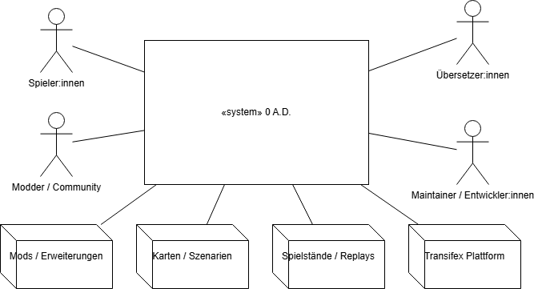
 
 Abbildung 3.1: Fachlicher Kontext von 0 A.D.
---

**Spieler:innen (Benutzer)**
**Spieler:innen interagieren direkt mit 0 A.D. indem sie Spiele starten, Karten auswählen, Zivilisationen wählen und Partien im Einzel- oder Mehrspielermodus durchführen.  
Eingabedaten sind hier Benutzereinstellungen und Steuerungsaktionen (z. B. Mausklicks, Tastatureingaben).  
Ausgabedaten sind Spielereignisse, visuelle Darstellungen und Spielstände.

**Modder / Community (Benutzer)**
Modder:innen erstellen neue Spielinhalte, wie Zivilisationen, Einheiten oder Karten, über die Modding-Interface von 0 A.D..  
Eingabedaten sind neue oder geänderte Dateien im Mod-Ordner (z. B. XML- und JSON-Dateien).  
Ausgabedaten sind die von der Engine geladenen Inhalte, die das Spiel erweitern oder verändern.

***Übersetzer:innen (Benutzer)**
Übersetzer:innen pflegen die Sprachdateien des Spiels über die Plattform Transifex.  
Eingabedaten sind übersetzte Texte im `.po`-Format, während Ausgabedaten aktualisierte Sprachdateien im Spiel sind, die mehrsprachige Benutzeroberflächen ermöglichen.

**Maintainer / Entwickler:innen (Benutzer)**
Maintainer und Entwickler:innen koordinieren Beiträge aus der Community, führen Code-Reviews durch und veröffentlichen neue Versionen des Spiels.  
Sie interagieren über Versionskontroll- und Review-Systeme (Git, Phabricator), die aber im fachlichen Kontext nur indirekt relevant sind.

**Karten / Szenarien (Fremdsystem)**
Karten definieren die Spielwelt, Ressourcenverteilung und Startpositionen. Sie werden vom Spiel beim Start einer Partie geladen.  
Eingabedaten sind XML/JSON-basierte Szenariodateien, Ausgabedaten sind visuelle Karten- und Umgebungselemente im Spiel.

**Mods / Erweiterungen (Fremdsystem)**
Mods sind externe Inhaltspakete, die von der Community erstellt werden. Sie erweitern oder ersetzen Spielmechaniken, Einheiten oder Ressourcen.  
Eingabedaten sind modifizierte Assets oder Skripte, Ausgabedaten sind die in das Spiel integrierten Inhalte.

**Spielstände / Replays (Fremdsystem)**
0 A.D. speichert laufende Partien als Spielstände und aufgezeichnete Replays.  
Eingabedaten sind zuvor gespeicherte Dateien, Ausgabedaten sind die wiederhergestellten oder exportierten Spieldaten.

**Transifex Plattform (Fremdsystem)**
Die Plattform Transifex dient zur Verwaltung und Pflege von Übersetzungen.  
0 A.D. importiert und exportiert `.po`-Dateien über diese Schnittstelle, um Sprachaktualisierungen in die Community zurückzuführen.


## 3.2 Technischer Kontext 

Der technische Kontext beschreibt die externen Systeme, Laufzeitumgebungen und Bibliotheken, mit denen **0 A.D.** interagiert.  
Die folgende Abbildung zeigt die wichtigsten technischen Abhängigkeiten des Spiels.

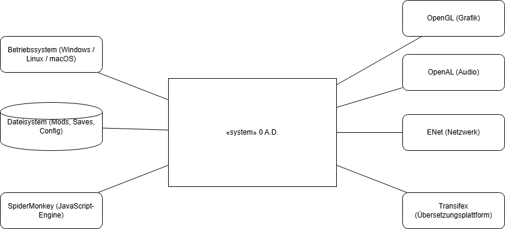

Abbildung 3.2: Technischer Kontext von 0 A.D.
---

**Betriebssystem (Windows / Linux / macOS)**
0 A.D. ist plattformübergreifend und nutzt die Betriebssysteme für grundlegende Dienste wie Dateizugriff, Eingabeverarbeitung (Maus, Tastatur) und Netzwerkkommunikation.  
Die Engine abstrahiert diese Funktionen über plattformunabhängige Bibliotheken (z. B. SDL).

**OpenGL (Grafik-API)**
Für die grafische Darstellung verwendet 0 A.D. die offene Programmierschnittstelle OpenGL.  
Diese ermöglicht hardwarebeschleunigtes Rendering von 3D-Objekten, Texturen und Effekten.

**OpenAL (Audio-API)**
Für die Audiowiedergabe nutzt 0 A.D. OpenAL, eine plattformübergreifende Audio-Bibliothek.  
Sie ermöglicht die räumliche Positionierung von Soundeffekten und Musik im Spiel.

**SpiderMonkey (JavaScript-Engine)**
Die JavaScript-Engine SpiderMonkey (entwickelt von Mozilla) wird zur Ausführung von Spielskripten verwendet.  
Sie ermöglicht die Steuerung von Simulation, Künstlicher Intelligenz (KI) und spielinterner Logik.

**ENet (Netzwerkbibliothek)**
Für den Mehrspielermodus verwendet 0 A.D. die leichtgewichtige Netzwerkbibliothek ENet.  
Sie sorgt für zuverlässige, latenzarme Kommunikation zwischen Clients und Servern über UDP.

**Dateisystem (Mods, Saves, Config)**
0 A.D greift über das lokale Dateisystem auf Spielinhalte, Mods, Konfigurationen und gespeicherte Spielstände zu.  
Hierüber erfolgt auch die Einbindung von benutzerdefinierten Erweiterungen und Ressourcen.

**Transifex (Übersetzungsplattform)**
Zur Verwaltung der Übersetzungen wird der externe Dienst Transifex eingesetzt.  
Über diese Schnittstelle werden `.po`-Dateien für Lokalisierungen importiert und exportiert.


# 4. Lösungsstrategie 

#### Dieser Abschnitt enthält einen stark verdichteten Architekturüberblick. Eine Gegenüberstellung der wichtigsten Ziele und Lösungsansätze.

## 4.1. Einstieg


| **Qualitätsziel**                                            | **Architektonische Ansätze zur Unterstützung**                                                                                                                                                                                                     |
| ------------------------------------------------------------ | -------------------------------------------------------------------------------------------------------------------------------------------------------------------------------------------------------------------------------------------------- |
| **Erweiterbarkeit** (neue Einheiten, Zivilisationen, Karten) | • Datengetriebenes Design: Spieleinhalte werden in XML / JSON beschrieben<br>• Klare Trennung zwischen Engine-Kern und Game-Content<br>• Modularer Asset-Loader und Skriptsystem<br>• Offene Modding-Schnittstelle für Community-Erweiterungen     |
| **Performance** (viele Einheiten gleichzeitig)               | • Entity-Component-System (ECS) für effiziente Datenverarbeitung<br>• Engine in C++ implementiert<br>• Deterministische Simulation für stabile Synchronisation<br>• Level-of-Detail-Rendering (LOD) zur Entlastung der Grafikebene                 |
| **Portabilität** (Windows, Linux, macOS)                     | • Nutzung plattformübergreifender Bibliotheken (OpenGL, SDL, Boost)<br>• Abstraktionsschichten für Grafik, Audio und Eingabe<br>• Minimale Betriebssystem-abhängigkeiten                                                                           |
| **Wartbarkeit** (klare Struktur und leichte Änderbarkeit)    | • Schichtenarchitektur (Rendering / Simulation / Netzwerk klar getrennt)<br>• Modularer C++-Code mit definierten Schnittstellen<br>• Spiel-Logik (JavaScript) getrennt vom Engine-Kern<br>• Strukturierte Code-Reviews durch Open-Source-Community |
| **Multiplayer-Zuverlässigkeit**                              | • Deterministische Simulation für alle Clients<br>• Synchronisation über Befehle statt Zustände<br>• Replay-System zur Fehleranalyse bei Desynchronisation                                                                                         |
| **Modding-Freundlichkeit**                                   | • Separate „Mods“-Verzeichnisse überlagern Basisdaten<br>• Automatisches Laden von Benutzer-Inhalten beim Start<br>• Einfache Anpassbarkeit durch XML / JSON-Struktur                                                                              |
| **Internationalisierung und Zugänglichkeit**                 | • Unicode-Unterstützung und Übersetzungsdateien (.po)<br>• Lokalisierte Benutzeroberfläche und Texte<br>• Layout-System unabhängig von Sprache und Schriftart                                                                                      |
| **Sicherheit und Stabilität**                                | • Sandboxed Scripting über JavaScript-Engine<br>• Versionskontrolle und Community-Überprüfung von Beiträge<br>• Deterministische Netzwerkarchitektur reduziert Cheating-Risiken                                                                    |


## 4.2. Aufbau 

0 A.D ist als plattformuabhängige (cross-platform) C++/JavaScript-Anwendung realisiert.Es zerfällt grob in folgende Teile:

- **1. Game-/Simulation-Engine**
  
  Verantwortlich für Spielschleife, deteminitische Simulation, Entity-Component-System (ECS), Pathfinding, Kampf- und Wirtschaftlogik.

- **2. Rendering und Audio Subsysteme**
  
  Zuständig für Darstellung der Spielwelt (Terrain, Einheiten, Effekte) sowie Wirdergabe von Sound und Musik, über plattformunabhängige Bibliotheken (z.B. OpenGL, OpenAL).

- **3. Daten und Content Layer**

  Beschreibt alles Spielinhalte (z.B. Einheiten, Gebäude, Karten, Items, etc.) in XML/JSON-Dateien sowie skriptbare Spiellogik in JavaScript, dient zugleicht als Grundlage für Modding.

- **4. Multiplayer / Networking Module**

  Implementiert  die deterministische, befehlsbasierte Synchronisation zwichen mehreren Spielern (Lockstep-Modell = alle Spieler führen die gleiche Simulation aus) sowie Replay-/Desync-Unterstützung.

- **5.  Graphical User Interface (GUI)**


    Menüsystem, Ingame-HUD, Auswahl und Befehlsoberfläche.
    Die GUI interagiert über Skripte mut der Engine und präsentiert dem Spieler Daten.

- **6.Mod-/Ressourcen-Loader**

  Lädt beim Start die Basisdaten und zusätzliche Mods aus getrennten Verzeichnissen und überlagert sie nach Priorität.


## 4.3 Spielstrategie / Integration  

Die Architektur von 0 A.D. folgt einer klaren Spielstrategie, die auf einem **deterministischen Simulationsmodell** und einer **datengetriebenen Trennung von  Engine und Spielinhalt** basiert.

Das System arbeitet in einem **kontinuerlichen Game Loop**, in dem Eingaber verarbeitet, Spielzustände aktualisiert und anschließend visualisiert werden.

- **1. Eingabe und Steuerung**

  - Spielerinteraktion über Tastatur und Maus werden vom input-System erfasst und in Befehle übersetzt.
  - In Single-Player mode werder Befehle direkt an  die Simulation gesendet, im Multiplayer mode werden sie zwischen allen Peers synschronisiert.

- **2. Simulation und Logik**

  - Die deterministische Simulation verarbeitet alle Befehle im nächsten Tick.

  - Das Entity-Component-System aktualisiert Positionen, Zustände, Ressourcen und Einheitenverhalten.

  - Skripte in JavaScript steuern KI, Wirtschaft und Kampflogik.

- **3. Rendering und Audio**

  - Nach der Simulation werden die aktualisierten Spielobjekte vom Rendering-System (OpenGL) dargestellt.

  - Das Audiosystem (OpenAL) spielt passende Geräusche und Musik ab.

- **4. Multiplayer-Synchronisation**

  - Alle Spieler führen dieselbe Simulation aus; nur Befehle werden über das Netzwerk ausgetauscht (Lockstep-Modell).

  - Dies garantiert identische Ergebnisse auf allen Rechnern.

- **5. Modulare Datenfluss**

  - Inhalte (Units, Gebäude, Karten) werden beim Start aus XML- und Skriptdateien geladen.

  - Das Mod-System kann zusätzliche Daten überlagern und zur Laufzeit erweitern.


## 4.4 Integration 

0 A.D. verbindet seine internen Systeme mit der Außenwelt über drei zentrale Schnittstellen: das Betriebssystem, das Mehrspieler-Netzwerk und das dateibasierte Daten- und Mod-System.
Die Spiel-Engine interagiert mit der Host-Plattform über plattformunabhängige Bibliotheken wie **SDL**, **OpenGL** und **OpenAL**, welche Eingabe, Darstellung und Audio einheitlich und betriebssystemübergreifend verarbeiten.
Für die Mehrspielerkommunikation verwendet 0 A.D. die **ENet( ***ENet ist eine kleine, schnelle und Open-Source-Netzwerkbibliothek, die in C geschrieben wurde und eine zuverlässige Kommunikation über das UDP-Protokoll ermöglicht***)**-Netzwerkbibliothek, um Spielerbefehle zwischen den Teilnehmern im **Lockstep-Synchronisationsmodell** auszutauschen. Dieser Ansatz reduziert die Netzwerklast und stellt sicher, dass bei allen Clients identische Simulationsergebnisse entstehen.
Alle Spieldaten und von der Community erstellten Erweiterungen werden über ein modulares Dateisystem verwaltet. Der **Mod-Loader** kombiniert beim Start des Spiels die Basisdaten dynamisch mit benutzerdefinierten Inhalten und Skripten, sodass neue Zivilisationen, Karten oder Spielmechaniken integriert werden können, ohne den Engine-Code zu verändern.

Durch diese Architektur besitzt 0 A.D. klar definierte Schnittstellen zum Betriebssystem, zum Netzwerk und zu benutzererstellten Inhalten. Dadurch bleibt der Kern der Engine unabhängig, stabil und leicht erweiterbar.


<br> 
<br> 
<br>
 
***High-level Integration Overview***

```

                                +-------------------------+
                                |     Player (User)       |
                                |  Mouse / Keyboard Input |
                                +-----------+-------------+
                                            |
                                            v
                                +-----------+-----------+
                                |       0 A.D. Engine    |
                                |------------------------|
                                |   Input Manager        |
                                |   Simulation Core      |
                                |   Rendering / Audio    |
                                +-----------+------------+
                                            |
                          +----------------+----------------+
                          |                                 |
                          v                                 v
                        +----------+                  +-------------+
                        |  Network | <--- Commands --->| Other Peers |
                        | (ENet)   |                  |   (Players)  |
                        +----------+                  +-------------+
                                            |
                                            v
                                    +--------------+
                                    |  Mod / Data  |
                                    |  File System |
                                    +--------------+

```


# Bausteinsicht 

Dieser Abschnitt beschreibt die Zerlegung von ***0 A.D.*** in seine Hauptmodule, wie sie sich auch in der Struktur des Quellcodes widerspiegelt.
Module der ersten Zerlegungsebene werden in ***0 A.D.*** als Subsysteme bezeichnet.
Die → Bausteinsicht, Ebene 1 stellt diese Subsysteme einschließlich ihrer Hauptaufgaben und Schnittstellen dar.

Für einige Subsysteme, insbesondere das → Simulationssystem (***Entity-Component-System***), enthält dieser Abschnitt zusätzlich eine detailliertere Zerlegung in → Ebene 2.


## 5.1 Überblick über die Subsysteme

Dieser Abschnitt beschreibt die wichtigsten Subsysteme von 0 A.D. auf oberster Ebene.
Die Architektur trennt den technischen Kern (Engine) von der Darstellung, den Spieldaten und der Benutzeroberfläche.
Jedes Subsystem erfüllt eine klar definierte Aufgabe und kommuniziert über wohlstrukturierte Schnittstellen mit anderen Modulen.

| **Subsystem**                | **Kurzbeschreibung**                                                                                                                                                                                               |
| ---------------------------- | ------------------------------------------------------------------------------------------------------------------------------------------------------------------------------------------------------------------ |
| **Game Engine Core**         | Steuert die Hauptspielschleife, verwaltet Ereignisse und Ressourcen. Stellt grundlegende Dienste wie Logging, Konfiguration und Initialisierung bereit.                                                            |
| **Simulationssystem (ECS)**  | Das zentrale Logiksystem des Spiels. Verwendet das **Entity-Component-System**-Prinzip, um Einheiten, Gebäude und Ressourcen zu verwalten. Beinhaltet Bewegungs-, Kampf-, Wirtschafts- und KI-Logik.               |
| **Rendering-Subsystem**      | Verantwortlich für die visuelle Darstellung der Spielwelt. Rendert Gelände, Einheiten und Effekte mithilfe von **OpenGL**. Aktualisiert die Szene basierend auf dem Simulationszustand.                            |
| **Audio-Subsystem**          | Steuert Soundeffekte und Hintergrundmusik. Nutzt **OpenAL** für räumliche Audiowiedergabe und sorgt für immersives Sounddesign.                                                                                    |
| **Netzwerkmodul**            | Ermöglicht Mehrspieler-Partien über eine **deterministische Simulation** mit **Befehlssynchronisation (Lockstep-Modell)**. Zuständig für Sitzungsverwaltung, Replays und Fehlerbehandlung bei Desynchronisationen. |
| **Benutzeroberfläche (GUI)** | Umfasst Menüs, das In-Game-HUD und Eingabeverarbeitung (Maus, Tastatur). Basierend auf **XML-Layouts** und **JavaScript-Logik**. Übersetzt Benutzereingaben in Simulationsbefehle.                                 |
| **Daten- und Mod-System**    | Lädt alle Spieldaten wie Einheiten, Karten, Zivilisationen, Skripte und Texturen. Unterstützt ein modulares Dateisystem, das das einfache Hinzufügen und Aktivieren von Mods ermöglicht.                           |
| **KI- und Scripting-Ebene**  | Implementiert computergesteuerte Gegner (z. B. Petra Bot) und Spielereignisse. Nutzt **JavaScript**, um KI-Verhalten, Strategien und Skripte für Gameplay zu definieren.                                           |
| *Tabelle: Überblick über Subsysteme von 0 A.D.*     |                                            |


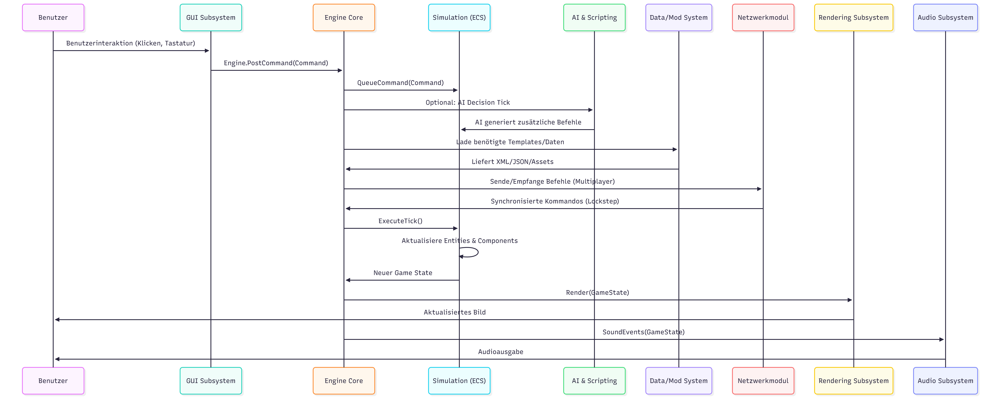
*Dieses Sequenzdiagramm repräsentiert den kompletten Architekturfluss.*

##  5.2  Game Engine 

Der Game Engine Core bildet das zentrale Steuersystem von *0 A.D.* und ist die Grundlage, auf der alle anderen Subsysteme aufbauen.
Er koordiniert die **Ausführung der Hauptspielschleife**, verwaltet **Ressourcen und Ereignisse** und stellt **gemeinsame Dienste** für Simulation, Rendering, Audio, Netzwerk und GUI bereit.
Darüber hinaus stellt der Engine-Kern eine umfangreiche **Skript-Schnittstelle (Engine API)** zur Verfügung, über die JavaScript-Code (z. B. aus der GUI, KI oder Simulation) direkt mit der C++-Engine interagieren kann.


### 5.2.1 Verantwortlichkeiten

1. **Hauptspielschleife**

    Der Engine-Kern steuert die kontinuierlich laufende Hauptschleife des Spiels.
    Jeder Schleifendurchlauf (Frame) führt mehrere Schritte aus:

    - Verarbeitung von Eingaben aus GUI und Netzwerk
    - Aktualisierung des Simulationssystems (Spielzustand und Logik)
    - Weitergabe aktualisierter Daten an Rendering- und Audio-Subsysteme
    - Verwaltung der Zeitschritte und Synchronisierung aller Subsysteme
    - Hintergrundaufgaben wie Laden von Assets oder Empfang von Netzwerkbefehlen

    Dadurch werden gleichmäßige Bildraten und eine stabile Ausführung des Spiels gewährleistet.

2. **Initialisierung und Beendigung**

    Beim Start initialisiert der Engine-Kern alle Subsysteme, lädt Konfigurationsdateien und Ressourcen,
    und richtet Rendering (OpenGL), Audio (OpenAL), Netzwerk (ENet) sowie Mod-Verzeichnisse ein.
    Beim Beenden werden alle Ressourcen sauber freigegeben, um Speicherlecks oder Datenverluste zu vermeiden.

3. **Ressourcen- und Ereignisverwaltung**

    Der Engine-Kern fungiert als zentrale Ereignis- und Ressourcenverwaltung.
    Subsysteme kommunizieren über Ereignisse anstatt direkter Aufrufe.
    Beispiel:

    - Die Simulation löst ein Ereignis „Einheit zerstört“ aus → das Rendering zeigt eine Explosion → das Audio-System spielt den passenden Sound.
    Zusätzlich verwaltet der Engine-Kern Caching und Zugriff auf Texturen, Modelle, Sounds und Skripte, um Ladezeiten zu reduzieren.

4. **Plattform-Abstraktionsschicht**

    Um 0 A.D. auf verschiedenen Betriebssystemen lauffähig zu machen, abstrahiert der Engine-Kern plattformspezifische Funktionen über Bibliotheken wie SDL oder Boost.
    Dadurch werden Dateizugriffe, Eingabegeräte, Threads und Fenstererstellung unabhängig vom Betriebssystem gehandhabt.

5. **Zeit- und Synchronisationsmanagement**

    Der Engine-Kern verwaltet konsistente Zeitwerte (Frame-Zeit, Simulationszeit, Delta-Zeit),
    um sicherzustellen, dass Simulation, Rendering und Netzwerk-Ticks synchron laufen.
    Das ist besonders wichtig für die Konsistenz im Mehrspielermodus.

6. **Logging, Debugging und Profiling**
Der Engine-Kern stellt Infrastruktur zum Protokollieren, Debuggen und Profilieren bereit.
Entwickler können während der Laufzeit Frame-Rate, Speicherverbrauch oder Simulationszeiten beobachten.
Über Funktionen wie ProfileStart() und ProfileStop() kann auch aus JavaScript heraus Performance gemessen werden.

### 5.2.2 Engine-API
Die API besteht aus Hunderten von Funktionen, die sich in mehrere Gruppen einteilen lassen:

| **Kategorie**                    | **Beispielfunktionen**                                                      | **Zweck**                                                          |
| -------------------------------- | --------------------------------------------------------------------------- | ------------------------------------------------------------------ |
| **Systemsteuerung**              | `Exit()`, `Crash()`, `GetEngineInfo()`, `GetBuildVersion()`                 | Kontrolle über Laufzeit, Debug-Informationen und Version           |
| **Datei- und Datenzugriff**      | `FileExists()`, `ReadJSONFile()`, `ListDirectoryFiles()`                    | Zugriff auf Spieldaten und Konfigurationsdateien                   |
| **Simulation & Gameplay**        | `PostCommand()`, `AddEntity()`, `DestroyEntity()`, `GetTemplate()`          | Senden und Verwalten von Spielbefehlen aus Skripten                |
| **GUI-Steuerung**                | `GetGUIObjectByName()`, `OpenChildPage()`, `SetGUIScale()`, `PlayUISound()` | Kontrolle der Benutzeroberfläche und Anzeigeelemente               |
| **Netzwerk**                     | `StartNetworkGame()`, `SendNetworkChat()`, `AssignNetworkPlayer()`          | Steuerung und Synchronisierung von Mehrspieler-Sitzungen           |
| **Konfiguration & Mods**         | `ConfigDB_SaveValue()`, `GetAvailableMods()`, `SetModsAndRestartEngine()`   | Verwaltung von Konfigurationen und aktivierten Mods                |
| **Internationalisierung (i18n)** | `Translate()`, `GetAllLocales()`, `SaveLocale()`                            | Übersetzungs- und Sprachunterstützung für GUI und Spieltexte       |
| **Debugging & Profiling**        | `ProfileStart()`, `ProfileStop()`, `DumpSimState()`                         | Messung und Analyse von Laufzeitverhalten und Simulationszuständen |

### 5.2.3 Beziehungen zu anderen Subsystemen
| **Subsystem**           | **Beschreibung der Interaktion**                                                       |
| ----------------------- | -------------------------------------------------------------------------------------- |
| **Simulation (ECS)**    | Der Engine-Kern ruft regelmäßig Simulations-Updates auf und empfängt Statusänderungen. |
| **Rendering**           | Erhält vom Engine-Kern aktuelle Simulationsdaten zur Darstellung.                      |
| **Audio**               | Spielt Sounds basierend auf Ereignissen aus Simulation oder GUI ab.                    |
| **Netzwerk**            | Tauscht Befehle und Synchronisations-Informationen über den Hauptloop aus.             |
| **GUI**                 | Nutzt die Engine-API, um Eingaben zu verarbeiten und Oberflächenelemente zu steuern.   |
| **Daten- & Mod-System** | Liefert Konfigurations- und Inhaltsdaten beim Start.                                   |
## 5.3 Simulationssystem (ECS)

Simulationssystem ist für die gesamte Logik und den Zustand der Spielwelt verantwortlich — also für Einheiten, Gebäude, Ressourcen, Bewegungen, Kämpfe und wirtschaftliche Abläufe.
Die Architektur des Systems basiert auf dem modernen Entwurfsmuster **Entity-Component-System (ECS)**, das hohe Flexibilität, Wiederverwendbarkeit und Performance ermöglicht.

### 5.3.1 Verantwortlichkeiten

1. **Verwaltung des Spielzustands**

    Das Simulationssystem speichert und aktualisiert alle Informationen über die Spielwelt:
    Positionen, Zustände, Eigentümer, Ressourcen, Trefferpunkte, Sichtweite usw.
    Es bestimmt, wie sich Einheiten bewegen, wie sie interagieren, kämpfen oder produzieren.

2. **Echtzeit-Logik**

    In jeder Simulations-Tick (Logik-Frame) werden alle relevanten Komponenten aktualisiert.
    Dadurch wird das Verhalten der Spielobjekte bestimmt, z. B. Pfadfindung, Kampfentscheidungen, Baufortschritt oder Ressourcenabbau.

3. **Synchronisation mit Netzwerk und Engine**

    Die Simulation erhält Befehle von der Benutzeroberfläche oder vom Netzwerkmodul
    und überträgt den aktualisierten Spielzustand an das Rendering- und Audio-Subsystem.
    Im Mehrspielermodus sorgt eine deterministische Simulation dafür, dass alle Clients denselben Spielverlauf haben.

4. **Ereignissteuerung und Messaging**

    Die Kommunikation innerhalb der Simulation erfolgt über Nachrichten (Events).
    Beispiel: Eine Einheit stirbt → das System sendet eine Nachricht „EntityDestroyed“ → andere Komponenten reagieren darauf (z. B. Soundeffekt oder Punktestand-Update).

5. **Erweiterbarkeit durch Daten und Skripte**

    Spielinhalte (z. B. Einheiten oder Gebäude) sind datengetrieben in XML/JSON beschrieben
    und können mit JavaScript-Skripten um spezifische Logik erweitert werden,
    ohne den C++-Code zu verändern.

### 5.3.2 ECS
Das Simulationssystem folgt dem ECS-Prinzip und ist in drei zentrale Strukturen gegliedert:
| **Element**                | **Beschreibung**                                                                                                                                                                                                                       |
| -------------------------- | -------------------------------------------------------------------------------------------------------------------------------------------------------------------------------------------------------------------------------------- |
| **Entity (Entität)**       | Repräsentiert ein einzelnes Spielobjekt – z. B. eine Einheit, ein Gebäude oder ein Projektil. Jede Entität besitzt eine eindeutige ID und besteht aus einer Menge von Komponenten.                                                     |
| **Component (Komponente)** | Kapselt Daten, die eine bestimmte Eigenschaft oder Fähigkeit beschreiben, z. B. Position, Gesundheit, Angriffskraft, Produktion oder Sichtweite. Komponenten enthalten **keine Logik**, nur Zustand.                                   |
| **System**                 | Implementiert die Logik, die auf Komponenten angewendet wird. Jedes System ist für einen bestimmten Aspekt zuständig, z. B. Bewegung, Kampf, Produktion, KI oder Sichtberechnung. Systeme werden in jedem Simulations-Tick ausgeführt. |

### 5.3.3 Komponenten und Systeme

| **Komponenten**                       | **Beispielhafte Systeme**                                       |
| ------------------------------------- | --------------------------------------------------------------- |
| `Position`, `Velocity`, `Orientation` | Bewegungssystem (aktualisiert Position und Richtung)            |
| `Health`, `Attack`, `Armor`           | Kampfsystem (führt Angriffe aus und berechnet Schaden)          |
| `ResourceGatherer`, `Storage`         | Wirtschaftssystem (sammelt Ressourcen, verwaltet Lagerbestände) |
| `ProductionQueue`, `Technology`       | Produktions-/Forschungssystem                                   |
| `Vision`, `Ownership`, `Formation`    | KI- und Sichtsysteme                                            |
| `Decay`, `Obstruction`, `Projectile`  | Umwelt- und Kollisionssysteme                                   |

## 5.4 Rendering Subsystem

Das **Rendering-Subsystem** ist für **grafische Darstellung der Spielwelt** verantwortlich.
Es bildet die Schnittstelle zwischen der Simulationslogik und der visuellen Ausgabe auf dem Bildschirm. Das System verarbeit die von der Simulatiuon bereitgestellten Datem (z.b Position, Animationen uzw.) und rendert daraus eine realistische , dynamische 3D-Spielwelt.
Das Rendering erfolgt plattformübergreifend über **OpenGl** und nutzt moderne Techsniken wie Schader , LOD(Leveld of Detail) und Culling.

### 5.4.1 Verantwortlichkeiten

- 1. **Darstellung der Spielwelt**

      Das Rendering-System übersetzt den abstrakten Spielzustand aus der Simulation (z. B. Einheiten, Gebäude, Gelände, Effekte) in sichtbare 3D-Objekte.
      Es verwaltet die Szenegraph-Struktur, in der alle darzustellenden Elemente organisiert sind.

- 2. **Kamerasteuerung und Sichtfeld**

      Die Kamera kann frei bewegt, rotiert und gezoomt werden.
      Das Rendering-System berechnet, welche Objekte im aktuellen Sichtfeld (Frustum) liegen, und rendert nur diese (Frustum Culling).

- 3. **Beleuchtung, Schatten und Effekte**

      Das System nutzt Shader-basierte Beleuchtung, dynamische Schatten und Partikeleffekte, um eine realistische Spielumgebung zu erzeugen.
      Wetter-, Feuer- und Explosionseffekte werden ebenfalls hier gesteuert.

- 4. **Level of Detail (LOD)**

      Abhängig von der Entfernung zur Kamera rendert das System Modelle mit unterschiedlicher Detailtiefe, um Performance zu optimieren.

- 5. **UI-Overlay**

      Neben der 3D-Welt rendert das Subsystem auch 2D-Overlays (z. B. Auswahlrahmen, Lebensbalken oder Minimap) über der Hauptszene.

- 6. **Performance und Optimierung**

      Das Rendering ist auf hohe Performance ausgelegt und nutzt Techniken wie Instancing, Textur-Atlas, Batch-Rendering und Occlusion Culling.
      Frame-Timing und GPU-Performance werden über das Engine-Profiling-System überwacht.


### 5.4.2 Aufbau 

Das Rendering-Subsystem besteht aus mehreren logischen Komponenten beispielweise :

| **Komponente**        | **Beschreibung**                                                                                |
| --------------------- | ----------------------------------------------------------------------------------------------- |
| **Scene Graph**       | Hierarchische Datenstruktur, die alle sichtbaren Objekte (Modelle, Effekte, Gelände) verwaltet. |
| **Terrain Renderer**  | Zeichnet Gelände, Höhenkarten, Texturen und Übergänge zwischen Biomen.                          |
| **Model Renderer**    | Rendert Einheiten, Gebäude und Objekte mit Animationen.                                         |
| **Water Renderer**    | Simuliert Wasser, Reflexionen und Wellenbewegungen.                                             |
| **Particle Renderer** | Verantwortlich für Effekte wie Rauch, Feuer, Staub oder Projektilspuren.                        |
| **Shader Manager**    | Lädt und verwaltet GPU-Shader (Beleuchtung, Transparenz, Texturen).                             |
| **Post-Processing**   | Fügt Nachbearbeitungseffekte hinzu (z. B. Bloom, Tiefenschärfe, Farbkorrektur).                 |

## 5.5 Audio Subsystem

Das **Audio-Subsystem** ist für die gesamte akustische Darstellung in 0 A.D verantwortlich.
Es verarbeitet Soundeffekte, Umgebungsgeräusche und Hintergrundmusik und sorgt dafür, dass akustische Ereignisse synchron zur Simulation und Darstellung ausgefürht werden.
Das System basiert auf der plattformübergreifenden Audio-Bibliothek **OpenAL**, welche 3D-Sound, Positionsberechnung und räumliche Audioeffekte unterstützt.

### 5.5.1 Verantwortlichkeiten

- 1. **Abspielen von Soundeffekten**

      Das Audio-System spielt Ereignissounds ab, wie Angriffe, Treffer, Gebäudefertigstellungen oder das Fällen eines Baumes.
      Diese Sounds werden durch Nachrichten aus der Simulation ausgelöst.

- 2. **Wiedergabe von Musik und Ambient-Sounds**

      Hintergrundmusik und Umgebungsgeräusche (Wind, Wasser, Tiere) laufen parallel zum Spielgeschehen und werden im Audio-Subsystem verwaltet.
      Es steuert Lautstärke, Übergänge und Wiedergabelisten.

- 3. **Räumliches (3D-)Audio**

      Die Position der Kamera und der Entitäten bestimmt, wie laut und aus welcher Richtung ein Sound abgespielt wird.
      Das System berechnet hierfür Lautstärkeabfälle, Panning und Filter, um ein realistisches Raumgefühl zu erzeugen.

- 4. **Audio-Mixing und Lautstärkekontrolle**

      Das System mischt unterschiedliche Audiokanäle (Effekte, Musik, Interface-Sounds) und bietet globale Regler für Spieler und Entwickler.

- 5. **Synchronisierung mit Simulation und Rendering**

      Die Audioausgabe reagiert auf Änderungen im Spielzustand, z. B.:

      - Einheit stirbt → Todesgeräusch
      - Projektil trifft → Aufprallsound
      - Gebäude startet Produktion → akustischer Hinweis

- 6. **Performance-Verwaltung**

      Das Audio-System arbeitet größtenteils asynchron und nutzt eigene Puffer, damit es die Framerate oder den Simulationsfluss nicht beeinflusst.

### 5.5.2 Aufbau

Das Audio-Subsystem besteht aus mehreren Komponenten :

| **Komponente**              | **Beschreibung**                                                                           |
| --------------------------- | ------------------------------------------------------------------------------------------ |
| **Sound Manager**           | Verwalten aller Soundquellen; steuert das Laden, Abspielen und Stoppen von Sounds.         |
| **Music Manager**           | Verwaltung von Hintergrundmusik, Wiedergabelisten und Übergängen.                          |
| **Audio Source Controller** | Repräsentiert eine einzelne Tonquelle (z. B. eine Einheit, Explosion oder Umgebungssound). |
| **Listener**                | Entspricht der Kamera; bestimmt, wie der Spieler den Ton wahrnimmt.                        |
| **OpenAL Backend**          | Bindings zu OpenAL für räumliches Audio und Hardwarebeschleunigung.                        |

## 5.6 Benutzeroberfläche

Die **Benutzeroberfläche (GUI)** von 0 A.D. ist für alle Interaktionen zwischen Spieler und Spiel zuständig.
Sie umfasst sowohl das **Hauptmenü**, die **Spielkonfiguration**, die **Lobby**, als auch das **In-Game-HUD**, über das der Spieler Einheiten auswählt, Befehle erteilt und Informationen über den Spielzustand erhält.
Die GUI wird überwiegend über **XML-Layout-Dateien und JavaScript-Skripte** definiert und ist somit vollständig daten- und skriptabhängig aufgebaut.
Dadurch ist sie besonders flexibel, leicht modifizierbar und gut erweiterbar.


### 5.6.1 verantwortlichkeiten

- 1. **Verarbeitung von Benutzereingaben**

      Die GUI interpretiert alle Eingaben des Spielers:

      - Mausaktionen (Klicken, Ziehen, Auswahlrechtecke)

      - Tastatureingaben (Hotkeys, Kamerasteuerung)

      - Menüinteraktionen

      - Diese Eingaben werden in Simulationsbefehle übersetzt, die an die ECS-Simulation weitergeleitet werden.

- 2. **Anzeige von Spielinformationen**

      Die GUI zeigt alle relevanten Daten an, wie:

      - Ressourcen und Spielstatistiken

      - Ausgewählte Einheiten und deren Attribute

      - Minimap

      - Bau- und Produktionsmenüs

      - Tooltips, Befehlsleisten und Einheitenaktionstasten
      Diese Informationen werden dynamisch aus der Simulation und dem Engine-Kern abgerufen.
    
- 3. **Navigieren durch Menüs und Spielmodi**

      Die GUI verwaltet Menülogik, z. B.:

      - Startmenü

      - Optionen (Audio, Grafik, Steuerung)

      - Kampagnen- und Szenariomenüs

      - Multiplayer-Lobby

      - Lade-/Speichermodi

- 4. **Kommunikation mit der Engine über die Engine-API**

      Die GUI nutzt viele Funktionen der Engine-API (z. B. Engine.GetGUIObjectByName, Engine.PickEntityAtPoint, Engine.PostCommand).
      Dadurch ruft sie sowohl Simulationsbefehle als auch Engine-Funktionen ab, ohne C++-Code zu berühren.

- 5. **Darstellung von Statusänderungen**

      Die GUI reagiert auf Spielereignisse:

      - Eine Einheit wird verletzt → Gesundheitsbalken ändern sich

      - Ein Gebäude wird fertiggestellt → Icons aktualisieren sich

      - Eine neue Technologie wird erforscht → Tooltip + Effekte
      Die GUI ist eng mit dem Event-System des Engine-Kerns verbunden.


### 5.6.2 Aufbau

Die GUI besteht aus meheren klar abgegrenzten Komponenten:

| **Komponente**             | **Beschreibung**                                                                            |
| -------------------------- | ------------------------------------------------------------------------------------------- |
| **XML-Layout-Dateien**     | Definieren die Struktur aller GUI-Elemente: Buttons, Panels, Tooltips, Frames.              |
| **JavaScript-Logik**       | Steuert dynamische Inhalte, reagiert auf Eingaben und führt Engine-API-Aufrufe aus.         |
| **GUI Renderer**           | Rendert 2D-Overlays und HUD-Elemente über der 3D-Spielszene.                                |
| **GUI Objekte / Controls** | Standard-Steuerelemente wie Buttons, Listen, Rahmen, Anzeigen.                              |
| **Interface Manager**      | Verwaltet GUI-Seiten (z. B. Menü → Spiel → Pausemenü) und sorgt für reibungslose Übergänge. |


# Laufzeitsicht 

Diese Sicht beschreibt im Gegensatz zur statischen Bausteinsicht die dynamischen Abläufe zur Laufzeit des Systems.Im Fokus steht nicht, aus welchen Modulen 0 A.D. besteht, sondern wie diese Module in typischen Szenarien zusammenarbeiten.

## 6.1 Beispiele für Szenarien

### 6.1.1 Beispiel 1: Spieler gibt einer Einheit einen Bewegungsbefehl (Move Command)


Dieses Diagramm zeigt das Zusammenspiel von **GUI** → **Engine Core** → **Simulation (ECS)** → **Rendering**.

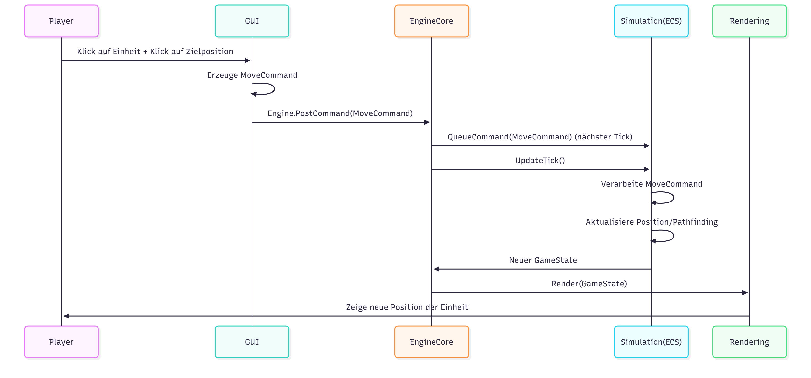

Der Benutzer löst eine Aktion aus, die GUI erzeugt einen passenden Command, dieser wird durch den Engine Core an die Simulation übergeben und nach Ausführung visuell dargestellt.
### 6.1.2 Beispiel 2: Multiplayer Lockstep – alle Clients synchronisieren Kommandos

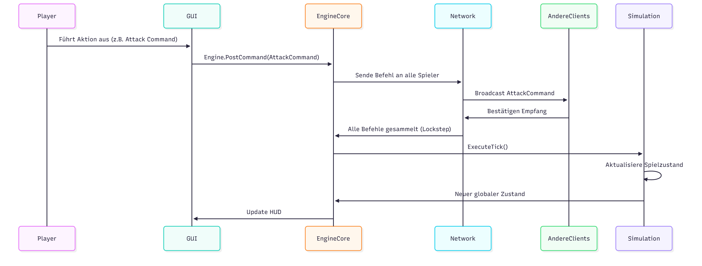

Hier wird gezeigt, wie 0 A.D. das deterministische Lockstep-Netzwerkmodell umsetzt:
Nach einem Spielbefehl werden die Commands über das Netzwerk an alle Clients verteilt.
Erst wenn alle Spieler denselben Befehl empfangen haben, wird der Simulations-Tick ausgeführt.

### 6.1.3 Beispiel 3: Start eine Spiels - Map laden

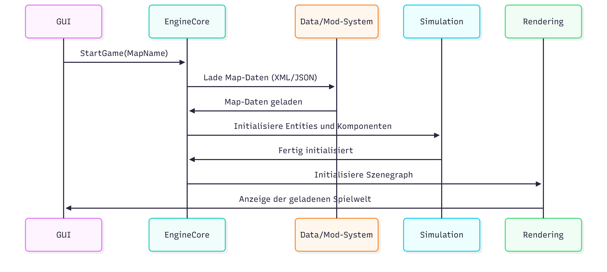

Dieses Diagramm beschreibt, wie beim Start eines Spiels die GUI den Engine Core anweist,
die notwendigen Ressourcen zu laden, die Simulation zu initialisieren und anschließend die Darstellung einzuleiten.

# 7 Verteilungssicht 


Die Verteilungssicht beschreibt die Laufzeitumgebung von **0 A.D.** sowie die technischen Knoten, auf denen das System betrieben wird. Im Mittelpunkt stehen sowohl die typische Installation auf einem lokalen Client-Rechner als auch das optionale Mehrspielerszenario, bei dem mehrere Clients über ein Netzwerk miteinander kommunizieren.

0 A.D. ist ein plattformübergreifendes Desktop-Spiel und läuft unter Windows, Linux und macOS. Die Engine nutzt OpenGL zur grafischen Darstellung, SpiderMonkey als JavaScript-Laufzeitumgebung sowie ENet als Netzwerkbibliothek für Multiplayer-Partien.

---

## 7.1 Infrastruktur – Ebene 1 (Knotenübersicht)

Die folgende Verteilungssicht umfasst zwei zentrale Ausführungsknoten:

**Lokaler Client-Rechner**  
  Standard-Client eines Spielers. Hier laufen die 0-A.D.-Spielengine, die JavaScript-Laufzeitumgebung sowie sämtliche Grafik- und Audio-Komponenten. Der Client greift auf das lokale Dateisystem zu, um Spielinhalte wie Karten, Mods, Texturen, Sounds sowie Spielstände und Replays zu laden bzw. zu speichern.

**Remote-Client (Mehrspieler)**  
  Optionaler zweiter Client im Mehrspielerbetrieb. Die Architektur basiert auf einem „Peer-to-Host“-Ansatz: Ein Client fungiert als Host, während weitere Clients sich über ENet mit diesem verbinden. Jeder Client führt eine vollständige Instanz der Spielengine aus.

Die Kommunikation erfolgt über ENet auf Basis von UDP. Zwischen den Clients werden in erster Linie Spielbefehle (z. B. Bewegungs- und Bauaufträge) sowie Synchronisationsnachrichten ausgetauscht, um einen konsistenten Spielzustand sicherzustellen – es werden keine Grafiken, Sounds oder Assets übertragen.


Abbildung 7: Verteilungssicht von 0 A.D.
---

## 7.2 Infrastruktur – Ebene 2 (Ausführungsumgebung des lokalen Clients)

Der lokale Client-Rechner umfasst folgende zentrale technische Bausteine:

**Betriebssystem (Windows / Linux / macOS)**  
  Stellt Basisdienste wie Prozessverwaltung, Dateizugriff, Eingabeverarbeitung (Maus, Tastatur) und Netzwerkkommunikation bereit. 0 A.D. unterstützt alle drei Plattformen offiziell.

**GPU und OpenGL-Treiber**  
  Die gesamte grafische Darstellung erfolgt mittels OpenGL. Die Engine nutzt die GPU und den jeweiligen Treiber, um 3D-Modelle, Texturen und Effekte hardwarebeschleunigt zu rendern. Mindestanforderung ist eine GPU mit OpenGL 2.1 oder höher.

**0 A.D. Spielengine (C++)**  
  Die native Engine bildet das Kernsystem und umfasst u. a.:
  - Simulationsschicht (Einheitenlogik, Ressourcenverwaltung, Spielregeln)  
  - Rendering-Schicht (3D-Darstellung, OpenGL-Anbindung)  
  - KI-Komponenten (z. B. skript-gesteuerte Gegner)  
  - UI-/GUI-System (Menüs, HUD, In-Game-Overlays)

**SpiderMonkey (JavaScript-Engine)**  
  Die in die C++-Engine eingebettete JavaScript-Laufzeit SpiderMonkey führt Spielskripte aus. Dazu zählen Simulationslogik, KI-Verhalten sowie Modding-Skripte. Dadurch ermöglicht 0 A.D. eine hohe Flexibilität und erweiterbare Gameplay-Logik.

**ENet (Netzwerkbibliothek)**  
  Für Multiplayer-Partien nutzt 0 A.D. ENet das eine latenzarme und zuverlässige UDP-basierte Kommunikation bereitstellt. ENet übernimmt Paketverwaltung, Verbindungsmanagement sowie grundlegende Zuverlässigkeitsmechanismen.

**OpenAL (Audio-System)**  
  Über OpenAL werden 3D-Sound und Effekte wiedergegeben. Die Engine nutzt OpenAL, um Audioausgabe plattformübergreifend zu abstrahieren.

**Dateisystem (Mods, Karten, Spielstände)**  
  Über das lokale Dateisystem lädt und speichert die Engine:
  - Karten und Szenarien (XML/JSON-basierte Definitionen)  
  - Mods und zusätzliche Inhalte  
  - Texturen, Modelle und Sounds  
  - Spielstände und Replays  

  Diese modulare Struktur erleichtert Modding und Benutzeranpassungen.

---

## 7.3 Kommunikationsbeziehungen im Mehrspielermodus

Im Mehrspielermodus verbindet sich der Remote-Client über ENet/UDP mit dem Host-Client:

- Der Host verwaltet die Multiplayer-Sitzung und fungiert als „Single Source of Truth“ für den globalen Spielzustand.  
- Clients senden Spielbefehle (z. B. Bewegungs- oder Bauaufträge) als Befehlsnachrichten an den Host.  
- Der Host verarbeitet diese Befehle in der Simulationsschicht und verteilt relevante Synchronisationsnachrichten (z. B. aktualisierte Zustände von Einheiten oder Ressourcen) zurück an alle Clients.  

Durch dieses Verfahren entsteht eine verteilte, deterministische Simulation, bei der alle Clients denselben Spielzustand reproduzieren, solange dieselbe Reihenfolge von Befehlen empfangen und verarbeitet wird.


# 8 Querschnittliche Konzepte 

## 8.1 Domänen- und Simulationsmodell (ECS)

Das Domänen- und Simulationsmodell von **0 A.D.** basiert vollständig auf einem Entity-Component-System (ECS). Dieses Modell trennt Spielobjekte in Entitäten, ihre Zustandsdaten in Komponenten sowie die eigentliche Logik in Systeme. Das ECS ist ein zentrales Querschnittskonzept, da nahezu alle Subsysteme des Spiels (Simulation, KI, GUI, Rendering, Netzwerk, Modding) darauf aufbauen oder damit interagieren.

Das ECS-Modell unterstützt mehrere zentrale Qualitätsziele von 0 A.D.:

- Erweiterbarkeit & Modding-Freundlichkeit: Spielinhalte sind vollständig datengetrieben und lassen sich durch neue Komponenten, Werte oder Skripte flexibel erweitern.  
- Determinismus & Multiplayer-Stabilität: Die Simulation läuft in festen Zeitschritten und liefert bei identischen Befehlen exakt dieselben Ergebnisse auf allen Clients.  
- Wartbarkeit: Klare Trennung zwischen Daten (Komponenten) und Logik (Systeme).  
- Performance: Systeme arbeiten effizient auf großen Mengen ähnlich strukturierter Daten, was insbesondere für RTS-Spiele mit vielen Einheiten entscheidend ist.

---

### Grundstruktur des ECS

#### Entitäten

Eine Entität repräsentiert ein konkretes Spielobjekt, z. B.:

- Einheiten, Gebäude, Tiere  
- Ressourcen (Bäume, Mineralien)  
- Projektile  
- Technologien, Effekte oder Statusobjekte  

Entitäten besitzen nur eine eindeutige ID und keine Logik. Ihr Verhalten ergibt sich ausschließlich aus den zugehörigen Komponenten.

---

#### Komponenten

Komponenten enthalten reine Zustandsdaten, z. B.:

- Position: Koordinaten im Weltkoordinatensystem  
- Health: Lebenspunkte  
- Attack: Angriffswerte und -typen  
- ResourceGatherer: Sammel- und Tragekapazitäten  
- Vision: Sichtweite  
- ProductionQueue: Produktions- und Forschungsslots  

Komponenten sind austauschbar, kombinierbar und datengetrieben.  
Sie werden über XML/JSON-Templates definiert (z. B. für Einheiten oder Gebäude) und können durch Mods überschrieben oder erweitert werden.

---

#### Systeme

Systeme enthalten die vollständige Simulationslogik und arbeiten pro Tick auf allen Entitäten, die bestimmte Komponenten besitzen.

Beispiele für Systeme:

- Bewegungssystem (Position, Geschwindigkeit, Pathfinding)  
- Kampfsystem (Attack, Health)  
- Wirtschaftssystem (ResourceGatherer, Storage)  
- Produktionssystem (ProductionQueue, Technology)  
- Sicht- und LOS-System (Vision)  
- KI-Systeme (strategische Entscheidungen, Mikro-Logik)  

Ein System besitzt keinen eigenen Zustand, sondern verarbeitet ausschließlich die Daten der Komponenten.

---

### Deterministische Simulationsschleife

Die Simulation von 0 A.D. läuft in diskreten, deterministischen Ticks.  
Für jeden Tick gilt:

1. Empfang und Verarbeitung von Befehlen (lokal oder aus dem Netzwerk)  
2. Ausführen aller Systeme in einer fest definierten Reihenfolge 
3. Aktualisieren aller betroffenen Komponenten  
4. Export von Änderungsereignissen an GUI, Rendering und Audio  

Diese feste Ausführungsreihenfolge ist Grundlage für:

- Multiplayer-Lockstep-Synchronisation
- Replays (Wiederholungen per Befehlslog)
- OOS-Erkennung (Out-of-Sync)  

Alle Systeme müssen deterministisch arbeiten, d. h. ohne unkontrollierte Zufallszahlen, ohne zeitabhängige Operationen und ohne nicht reproduzierbares Verhalten.

---

### Interaktion mit anderen Subsystemen

Das ECS beeinflusst mehrere Subsysteme querschnittlich:

- GUI: Fragt Entitätsdaten (z. B. Lebenspunkte, Attribute, Befehlsoptionen) über die Engine-API ab.  
- KI: Nutzt ECS-Komponenten, um Entscheidungen über Angriffe, Expansion oder Wirtschaft zu treffen.  
- Pathfinding: Verwendet Positions- und Obstruktionskomponenten.  
- Rendering: Liest visuelle Komponenten (Modelle, Animationen, Ausrichtung).  
- Multiplayer: Alle Entitäten/Komponenten werden deterministisch synchronisiert.  
- Modding: Neue Einheiten, Technologien oder Mechaniken entstehen durch Kombination von Komponenten und/oder neuen Systemen.

Damit bildet das ECS das Rückgrat der gesamten Spielweltlogik.

---

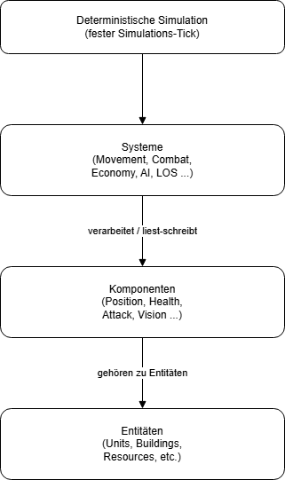

Abbildung 8.1: Ablaufdiagramm der ECS-Struktur 

## 8.2 Datengetriebenes Design & Modding-Konzept

0 A.D. folgt einem strikt datengetriebenen Architekturprinzip, um hohe Flexibilität, Erweiterbarkeit und Modding-Freundlichkeit sicherzustellen.  
Alle spielrelevanten Inhalte — Einheiten, Gebäude, Technologien, Zivilisationen, Karten, KI-Verhalten und die gesamte Benutzeroberfläche, sind nicht im C++-Engine-Code implementiert, sondern werden vollständig über externe Daten beschrieben.

Dies ermöglicht es Gameplay-Designer:innen und Community-Modder:innen, Inhalte zu verändern oder zu erweitern, ohne Anpassungen an der Engine vorzunehmen.  
Das Konzept ist damit ein zentraler Beitrag zur langfristigen Wartbarkeit und Weiterentwicklung des Spiels.

---

### Trennung von Engine und Spieldaten

Die C++-Engine *Pyrogenesis* stellt ausschließlich die technische Basis bereit, darunter:

- Rendering (OpenGL)
- Audio (OpenAL)
- deterministische ECS-Simulation    
- Lockstep-Netzwerkmodell für Multiplayer
- JavaScript-Laufzeitumgebung (SpiderMonkey)
- Mod- und Daten-Ladesystem (virtuelles Dateisystem)

Die konkreten Spielregeln sind nicht im Engine-Code hinterlegt.  
Stattdessen werden sie vollständig durch externe Daten definiert:

- Lebenspunkte  
- Angriffswerte  
- Baukosten  
- Forschungseffekte  
- Sichtweite  
- Zivilisationsboni  
- Ressourcenraten  

Damit bleibt die Engine generisch, während das Gameplay flexibel über Daten gesteuert werden kann.

---

### Datentypen und Formate

0 A.D. nutzt offene und leicht verständliche Formate zur Definition von Spielinhalten:

- XML: Entity Templates (Einheiten, Gebäude, Ressourcen)
- JSON: Technologien, Zivilisationsdaten, Auren
- JavaScript: KI-Skripte, Trigger, GUI-Logik
- XML + JavaScript: Benutzeroberfläche (Layouts + Logik)
- Grafik- und Audiodateien: Modelle, Texturen, Animationen, Sounds
- PO-Dateien: Internationalisierung

Alle spielrelevanten Eigenschaften werden in diesen Dateien beschrieben und können ohne Engine-Modifikation geändert werden.

---

### Mod-Load-System und Override-Mechanismus

Das Modding-System verwendet ein *layer-based overlay model*, das über ein virtuelles Dateisystem (VFS) umgesetzt wird.

Typische Lade-Reihenfolge:

1. `public.zip` — Basispaket der Spielinhalte  
2. `binaries/data/mods/public/` — Hauptspiel („public“-Mod)  
3. `binaries/data/mods/<modname>/` — Benutzer- und Community-Mods  

Regeln des Override-Systems:

- Mods, die später geladen werden, besitzen höhere Priorität.
- Dateien mit identischem Pfad können vollständig überschrieben werden.
- Neue Inhalte können nicht-destruktiv hinzugefügt werden.
- Die Engine führt alle Datenquellen zu einem konsistenten Gesamtzustand zusammen.

Dies ermöglicht Mods unter anderem:

- neue oder veränderte Einheiten  
- alternative Balance-Werte  
- neue Technologien oder Zivilisationen  
- komplette Total-Conversions  
- Änderungen an der Benutzeroberfläche oder KI  

---
### Architekturelle Auswirkungen

Das datengetriebene Design hat weitreichende Konsequenzen für mehrere Teile der Architektur:

- ECS-Komponenten lesen ihre Konfiguration direkt aus Templates, z. B. Sichtweite, Geschwindigkeit oder Ressourcenraten.

- Gameplay-Logik basiert vollständig auf externen Daten, nicht auf hartkodierten Regeln.

- Multiplayer-Determinismus setzt voraus, dass alle Clients exakt dieselben Datenversionen laden.

- Internationalisierung fügt sich nahtlos in die Datenstruktur ein (PO-Dateien als modulare Inhalte).

- Mod-Kompatibilität ergibt sich aus Prioritäten, klar definierten Ladeschichten und Überlagerungsregeln.

- Sicherheit: JavaScript-Code läuft in einer Sandbox, wodurch Mod-Skripte vom Engine-Kern isoliert bleiben.

Das Konzept ist somit ein zentraler Baustein für die konzeptionelle Integrität, Erweiterbarkeit und interne Qualität der gesamten 
0-A.D. Architektur.

## 8.3 Skripting und Engine-Integration (C++ / JavaScript)

0 A.D. setzt bewusst auf eine hybride Architektur aus C++ und JavaScript.  
Performancekritische Funktionen wie Rendering, Simulationstakt, Pathfinding oder Netzwerklogik sind in C++ implementiert, während JavaScript für flexible, datengetriebene Spiellogik sorgt.  
Dieses Konzept ermöglicht eine klare Trennung zwischen Engine und Gameplay, unterstützt Modding und erlaubt schnelle Anpassungen ohne Eingriffe in den C++-Kern.

0 A.D. integriert die JavaScript-Engine *SpiderMonkey* direkt in die C++-Engine (*Pyrogenesis*).  
JavaScript wird an mehreren Stellen genutzt:

- Simulation Components (ECS): Teile der Spieleinheiten-Logik (z. B. Attack, Heal, UnitAI) sind als JavaScript-Komponenten implementiert.
- KI-Skripte: Gegner-KI (z. B. Petra Bot) ist vollständig in JavaScript realisiert.
- Technologien & Effekte: Tech-Effekte und Auren werden in Skripten verarbeitet.
- Trigger- und Szenariologik: Ereignisse auf Karten und in Kampagnen werden über JS gesteuert.
- GUI-Logik: Benutzeroberflächen verwenden XML für Layouts und JavaScript für Ereignisbehandlung und dynamische Inhalte.

Die Engine stellt hierfür ein kontrolliertes API bereit, über das JavaScript sicher mit der Simulation interagiert.

---

### Integration zwischen C++ und JavaScript
Die Verbindung zwischen beiden Welten erfolgt über eine klar definierte Engine-API:

- Zugriff auf Entitäten und ihre Komponenten
- Erstellen, Ändern und Entfernen von Entities
- Senden von Simulation Commands
- Zugriff auf deterministische Zufallszahlen
- Kommunikation über das interne Messaging-System
- Abfragen von Spielerzuständen, Technologien oder Sichtbereichen

JavaScript läuft dabei in einer *Sandbox*, die sicherstellt, dass Skripte:

- nicht auf das Betriebssystem zugreifen,
- keine Threads starten,
- keine Dateien schreiben,
- und ausschließlich Engine-Funktionen verwenden.

Dieses Sandbox-Modell verhindert Sicherheitsrisiken und ist für Multiplayer-Determinismus unverzichtbar.

---

### Rolle im Simulationsablauf
Jeder Simulationstakt (Tick) läuft nach demselben Muster ab:

1. C++-Engine ruft Systems und Komponenten auf.
2. JavaScript-Komponenten führen ihre Logik aus (z. B. Angriff prüfen, KI-Entscheidungen treffen).
3. Änderungen an Komponenten werden zurück in die Engine synchronisiert.
4. Rendering- und Audio-Subsysteme verarbeiten den neuen Zustand.

Damit ist JavaScript direkt in den Simulationsfluss integriert und steuert einen wesentlichen Teil der Spielmechanik.

**Beispiel: JavaScript in einer Simulation-Komponente**
Ein vereinfachtes Beispiel (offizielle Struktur) aus einer Attack-Komponente:

```javascript
PerformAttack: function(target) {
    if (!this.CanAttack(target))
        return;

    let damage = this.GetAttackStrength();
    Engine.PostMessage(this.entity, { "type": "Attack", "target": target, "damage": damage });
}
```
Das Skript nutzt Engine-Funktionen, bleibt aber vollständig deterministisch.

---

### Architekturelle Auswirkungen

Dieses Konzept hat mehrere querschnittliche Auswirkungen:

- Modding-Unterstützung: neue Mechaniken, Technologien oder Einheitentypen können durch JS-Logik ergänzt werden, ohne die Engine zu verändern.
- Determinismus im Multiplayer: JavaScript muss deterministisch ausgeführt werden; deshalb sind Zufallszahlen und Timing-Funktionen streng kontrolliert.

- Wartbarkeit: Gameplay-Logik kann leichter angepasst werden, da sie außerhalb des C++-Kerns liegt.

- Sicherheit: Durch Sandbox-Ausführung sind externe Mods isoliert und können nicht auf Betriebssystemfunktionen zugreifen.

- Konsistenz zwischen Komponenten: Die Integration beeinflusst Simulation, KI, GUI und Datenhaltung gleichermaßen und ist daher ein zentrales Querschnittskonzept.

## 8.4 Netzwerk- und Determinismuskonzept (Lockstep)

0 A.D. verwendet im Mehrspielermodus ein deterministisches Lockstep-Modell.  
Dabei führen alle teilnehmenden Clients die vollständige Simulation lokal aus, während über das Netzwerk ausschließlich Spielerbefehle ausgetauscht werden.  
Dieses Verfahren reduziert den Bandbreitenbedarf, sorgt für faire und konsistente Spielabläufe und ermöglicht exakte Replays.  
Da die gesamte Simulation auf deterministische Ausführung angewiesen ist, zählt dieses Konzept zu den wichtigsten querschnittlichen Aspekten der Architektur.

Im Multiplayer nutzt 0 A.D. eine *Peer-to-Host-Topologie*, bei der ein Client als Host die Sitzung verwaltet.  
Trotzdem läuft die vollständige Simulation auf *allen* Clients, einschließlich des Hosts.

Das Lockstep-Modell funktioniert wie folgt:

1. Die Simulation ist in feste Ticks (Simulationsschritte) unterteilt.  
2. Jeder Client sendet seine Befehle für Tick *N* an den Host.  
3. Der Host verteilt die vollständige Befehlsliste an alle Spieler.  
4. Alle Clients führen den Tick mit exakt denselben Eingaben aus.

Es werden keine Zustände wie Positionen oder Trefferpunkte übertragen, sondern nur abstrakte Befehle wie „Bewege Einheit“ oder „Beginne Bau“.  
Dadurch bleiben Bandbreite und Netzwerklast minimal.

### Determinismus-Anforderungen
Damit alle Clients nach jedem Tick denselben Spielzustand erreichen, gelten strenge Anforderungen:

- Alle Clients müssen identische Daten, Templates und Mods verwenden.  
- JavaScript-Skripte dürfen keine nicht-deterministischen Funktionen nutzen (z. B. Zeitfunktionen).  
- Zufallszahlen stammen aus einem deterministischen RNG mit gemeinsamem Seed.  
- Die Simulation verwendet diskrete Zeit und ist vom Systemzeitpunkt unabhängig.  
- Kritische Logik vermeidet plattformabhängige Floating-Point-Abweichungen.

Kommt es dennoch zu Abweichungen, erkennt die Engine eine Out-of-Sync (OOS) Situation, die zur Fehleranalyse und Replay-Validierung dient.

### Rolle der Netzwerkebene (ENet)
0 A.D. verwendet ENet, eine zuverlässige UDP-basierte Bibliothek, um Befehle zwischen Host und Clients auszutauschen.  
ENet stellt sicher:

- geordnete und zuverlässige Zustellung,  
- effiziente Paketverwaltung,  
- und stabile Verbindungen mit geringer Latenz.

Die Lockstep-Logik baut auf ENet auf und benötigt lediglich, dass für jeden Tick alle Befehle in korrekter Reihenfolge eintreffen.

### Architekturelle Auswirkungen
Das Lockstep-Modell wirkt sich auf zahlreiche Teile des Systems aus:

- Simulation und ECS müssen deterministisch arbeiten.  
- JavaScript läuft in einer Sandbox und darf nur deterministische Engine-APIs nutzen.  
- Modding beeinflusst Multiplayer-Kompatibilität unmittelbar; unterschiedliche Mods führen zu OOS.  
- Performance hängt von der langsamsten Verbindung bzw. dem langsamsten Client ab.  
- Replay- und OOS-Diagnose basieren vollständig auf dem deterministischen Befehlsstrom.

Damit prägt das Lockstep-Konzept nicht nur das Netzwerkmodul, sondern die gesamte Struktur der Simulation, des Skriptings und der Datenhaltung – und ist daher ein zentraler Bestandteil der Architektur von 0 A.D.

## 8.5 Ressourcen- und Asset-Management (Virtual File System, VFS)

0 A.D. verwendet ein Virtual File System (VFS), um den Zugriff auf alle Spieldaten und Assets zu vereinheitlichen – unabhängig davon, wo sie auf dem Datenträger liegen.  
Da das Spiel stark datengetrieben ist und umfangreiches Modding unterstützt, benötigt die Engine einen konsistenten Mechanismus zum Auffinden, Zusammenführen und Überschreiben von Dateien.  
Das VFS stellt plattformunabhängige Pfade bereit, vereinfacht die Integration von Mods und trägt zu Sicherheit und Determinismus bei.

Das VFS abstrahiert das zugrunde liegende Dateisystem, indem es einen *einheitlichen virtuellen Verzeichnisbaum* zur Verfügung stellt.  
Mehrere physische Quellen werden in diesen Baum eingebunden:

- Kernspieldaten (z. B. `public.zip`),  
- das Basis-Spielmodul,  
- benutzererstellte Mods,  
- benutzerspezifische Datenverzeichnisse.

Existiert derselbe virtuelle Pfad in mehreren Quellen, setzt sich die zuletzt eingehängte Quelle durch.  
Dieses Verhalten bildet die technische Grundlage des in Abschnitt 8.2 beschriebenen Mod-Layers.

Die Engine greift ausschließlich über virtuelle Pfade wie:

- `simulation/templates/...`  
- `art/actors/...`  
- `gui/...`  
- `maps/...`  
- `audio/...`

auf Dateien zu und vermeidet damit betriebssystemspezifische Pfadangaben.

### Ressourcenarten und Nutzung
Über das VFS laden alle Subsysteme ihre benötigten Daten:

- Simulationsdaten: XML-Templates, Technologiescripte, Auren, Einheitenwerte.  
- Skripte: JavaScript für KI, Trigger und GUI-Logik.  
- Karten und Szenarien: Höhenkarten, Texturen, Trigger-Skripte.  
- Grafik-Assets: Texturen, Meshes, Animationen, Partikeleffekte, Actor-Dateien.  
- Audio-Assets: Geräusche, Musik und Umgebungsgeräusche.  
- Lokalisierung: PO-Dateien für Übersetzungen.

Da das VFS eine einheitliche Abstraktion bietet, können diese Ressourcen flexibel organisiert oder überschrieben werden, ohne Änderungen am Engine-Code vorzunehmen.

### Sicherheits- und Integrationsaspekte
Das VFS erzwingt strikte Path-Whitelists.  
Verschiedene Engine-Komponenten – einschließlich JavaScript – dürfen nur auf definierte virtuelle Verzeichnisse zugreifen.  
Dadurch wird verhindert, dass:

- auf Betriebssystempfade zugegriffen wird,  
- Dateien außerhalb erlaubter VFS-Bereiche gelesen werden,  
- Mods potenziell unsichere Dateizugriffe durchführen.

Dieses Modell unterstützt Sandboxing, Determinismus und einen stabilen Multiplayer-Betrieb, da alle Clients dieselbe VFS-Struktur verwenden.

### Architekturelle Auswirkungen
Das VFS wirkt sich auf zahlreiche Bereiche der Architektur aus:

- **Modding**  
  Mods werden als zusätzliche VFS-Mounts eingebunden; Überschreibverhalten ergibt sich automatisch.

- **Datengetriebenes Design**  
  Alle Templates, Technologien und GUI-Dateien werden über virtuelle Pfade geladen.

- **Scripting und Sicherheit**  
  JavaScript erhält nur Zugriff auf freigegebene Verzeichnisse, wodurch Mods sicher ausgeführt werden können.

- **Portabilität**  
  Die gleichen virtuellen Pfade funktionieren auf Windows, Linux und macOS.

- **Performance**  
  Als zentraler Zugriffspunkt unterstützt das VFS Caching, Profiling und effizientes Laden von Assets.

Damit stellt das Virtual File System ein wesentliches Querschnittskonzept dar, das die gesamte Laufzeitumgebung von 0 A.D. prägt und die modfreundliche Architektur des Spiels entscheidend ermöglicht.

## 8.6 Internationalisierung (I18N-Konzept)

0 A.D. wird von einer internationalen Community entwickelt und gespielt.  
Damit das Spiel weltweit zugänglich ist, unterstützt die Engine eine vollständig datengetriebene Internationalisierung.  
Alle sichtbaren Texte von GUI-Elementen über Einheitenbeschreibungen bis hin zu Technologien können ohne Änderungen am C++-Code lokalisiert werden.  

Das I18N-Konzept ist deshalb ein zentrales Querschnittsthema:  
Es betrifft die GUI, die templates, JavaScript-Skripte, das Mod-System und den gesamten Asset-Ladeprozess.

---

### Transifex als Übersetzungsplattform

Die Übersetzungen von 0 A.D. werden von der Community über Transifex gepflegt.  
Transifex dient als zentrale Plattform, auf der Freiwillige Übersetzungen bearbeiten, prüfen und aktualisieren.

### PO-Dateien als Laufzeitformat

Die Engine selbst lädt gettext-basierte `.po`-Dateien, die vom Build-Prozess aus Transifex exportiert werden.  
Die Struktur der Dateien folgt dem klassischen gettext-Modell:

```po
msgid "Stone"
msgstr "Stein"
```
Jede aktive Mod kann eigene PO-Dateien bereitstellen.
Der Virtual File System (VFS) Layer bestimmt dabei, welche Dateien Priorität haben.

---

### Integration in Engine und Spielinhalte

**1. GUI (XML + JavaScript):**

Alle GUI-Elemente werden zur Laufzeit über die Engine-Funktion
Engine.Translate() oder automatisch über Layout-Attribute übersetzt.

Beispiele:
- Menütexte
- Tooltip-Beschreibungen
- Buttons, Labels, HUD-Elemente
- Chat- und Lobby-Texte

**2. Entity Templates:**

Templates enthalten englische Standardtexte, z. B. für:
- Einheitennamen
- Beschreibungen
- Technologien
- Auren / Effekte

Die GUI fordert die Übersetzung über die String-ID an, der Simulationscode bleibt sprachneutral.

**3. JavaScript-Skripte:**

JavaScript-Code kann dynamische Texte übersetzen, z. B.:
```
let text = Engine.Translate("Attack Damage");
```
Dies betrifft:
- dynamische GUI-Elemente
- Technologie- und Statistikfenster
- Meldungen und Ereignisse

---

Die Engine lädt die .po-Dateien zur Laufzeit über den VFS und wendet Übersetzungen beim Rendern der GUI an. Fehlende Übersetzungen fallen automatisch auf Englisch zurück.

---

### Architekturelle Auswirkungen

* Trennung von Logik und Darstellung:
Die Simulation arbeitet ausschließlich mit IDs und englischen Basiswerten;
nur die Darstellungsebene nutzt Übersetzungen.

* Modding-Unterstützung:
Mods können eigene Übersetzungen liefern oder vorhandene überschreiben.
Das PO-System ermöglicht vollständige Lokalisierung von Mod-Content.

* VFS-Integration:
Die Übersetzungsdateien folgen denselben Prioritätsregeln wie alle Assets.
Spätere Mods überschreiben frühere PO-Dateien.

* Wartbarkeit: 
Durch die externe Verwaltung über Transifex bleibt der Entwicklungsprozess
schlank und community-freundlich.

* Konsistenz:
Das gettext-basierte Format garantiert einheitliche Struktur und Werkzeuge
(Merge-Tools, automatisierte Checks, Syntaxvalidierung).

## 8.7 Replay-, OOS- und Synchronisationskonzept

Das deterministische Simulationsmodell von 0 A.D. ermöglicht Multiplayer-Spiele, reproduzierbare Replays und eine systematische Analyse von Synchronisationsfehlern.  
Replay-, OOS- und Synchronisationsmechanismen greifen eng ineinander und betreffen Simulation, Netzwerk, Modding und Debugging gleichermaßen.

---

### Replay-System (deterministischer Befehlsstrom)
0 A.D. speichert Replays als Sequenz von Spielerbefehlen pro Simulations-Tick, nicht als Video. Ein Replay enthält:

- den initialen Spielzustand  
- Kartendaten und Seed  
- Spieloptionen  
- den vollständigen Befehlsstrom aller Spieler  

Beim Abspielen wird die Partie vollständig neu simuliert. Da die Simulation deterministisch ist, entspricht der Ablauf exakt dem ursprünglichen Spiel.

**Architekturelle Auswirkungen:**

- Replays sind plattformübergreifend identisch  
- Dateien bleiben sehr klein  
- Änderungen an Templates, Komponenten oder Skripten können ältere Replays ungültig machen  

---

### OOS-Erkennung (Out-of-Sync Detection)
Ein OOS tritt auf, wenn zwei Clients trotz identischer Befehle unterschiedliche Simulationszustände erzeugen.

Die Engine erkennt OOS durch:

- regelmäßige Berechnung eines State-Hashes  
- Austausch der Hashes über das Netzwerk  
- Vergleich der Hashes zwischen allen Teilnehmern  

Bei einer Abweichung erzeugt die Engine:

- detaillierte State Dumps  
- Replay-Fragmente zum Vergleich  
- Diagnose-Logs zur Fehlersuche  

Dies erleichtert die Analyse nichtdeterministischer Modifikationen oder fehlerhafter Systemkomponenten.

---

### Synchronisation im Lockstep-Modell
Die Grundlage für Multiplayer und Replays ist das bereits in 8.4 beschriebene Lockstep-Modell.  
Für diesen Abschnitt relevant ist insbesondere:

- Es werden ausschließlich Befehle synchronisiert, nie Spielzustände  
- Jeder Client simuliert den Spielzustand lokal  
- Identische Eingaben pro Tick garantieren identische Ergebnisse  

Das identische Befehlsmodell ermöglicht:

- deterministische Replays  
- klar nachvollziehbare Sync-Probleme  
- reproduzierbares Debugging  

---

### Anforderungen an deterministisches Verhalten

#### JavaScript
- Verwendung des engine-eigenen deterministischen RNG  
- keine zeit- oder plattformabhängigen Operationen  
- keine Iterationen über nicht deterministische Datenstrukturen  

#### C++/Engine
- deterministische Abläufe und konsistente Rechenoperationen  
- plattformneutrale Implementierung kritischer Funktionen  
- keine hardwareabhängigen oder undefinierten Prozesse  

#### Modding
Mods müssen deterministisch implementiert sein, da ansonsten:

- Multiplayer-Sitzungen OOS gehen  
- Replays inkonsistent werden  
- die Simulation divergiert  

---

### Debugging-, Logging- und Analysewerkzeuge
Zur Unterstützung von Entwicklern und Moddern stellt die Engine verschiedene Mechanismen bereit:

- OOS Dumps mit vollständigen Simulationsdaten  
- State-Hash-Auswertungen zur Fehlersuche  
- Replay-Verifikationsmodus zur Reproduktion von Bugs  
- Turn-Logs zur Analyse der Befehlsausführung  

Diese Werkzeuge machen das deterministische Modell trotz strenger Randbedingungen gut wartbar.

# Architekturentscheidungen 

Dieser Abschnitt stellt drei zentrale Architekturentscheidungen vor, die die Struktur von 0 A.D. beeinflussen.

---

## 9.1 Lockstep-Modell und deterministische Simulation im Multiplayer

### Zur Fragestellung
Eine zentrale Anforderung von 0 A.D. ist die Unterstützung schneller, fairer und skalierbarer Multiplayer-Modus.  
Ein Echtzeitstrategiespiel erzeugt pro Sekunde tausende Zustandsänderungen, Bewegungen, Angriffe, Ressourcensammlungen, Bauprozesse usw.  
Die Frage lautet daher: **Wie bleiben alle Clients synchron, ohne den Netzwerkverkehr zu überlasten?**

0 A.D. muss sicherstellen, dass auf allen Rechnern exakt dieselbe Spielsituation entsteht.  
Die Architektur muss festlegen, **wie der autoritative Zustand entsteht** und **wie die Simulation auf allen Clients im Gleichschritt abläuft**.

---

### Relevante Einflussfaktoren

#### Randbedingungen
- Simulationstakte: 10–30 Updates pro Sekunde  
- Bis zu 8 Spieler pro Match  
- Begrenzte Bandbreite für internationale Spiele notwendig  
- Peer-to-Peer-Modell bevorzugt (kein Server simuliert das gesamte Spiel)

#### Betroffene Qualitätsmerkmale
- Konsistenz / Korrektheit  
- Effizienz durch minimalen Netzwerkverkehr  
- Fairness gegenüber Spielern mit höherer Latenz  
- Modifizierbarkeit, da deterministische Abläufe reproduzierbar sind  

#### Betroffene Risiken
- Out-of-Sync (OOS) bei deterministischen Abweichungen  
- Langsamster Client bestimmt die Spielgeschwindigkeit  
- Erschwerte Fehlersuche bei verzögerter Befehlsausführung  

#### Annahmen
- Die Simulation kann vollständig deterministisch implementiert werden  
- Alle relevanten Operationen können identisch auf allen Clients ablaufen  
- Spieler tolerieren geringe Eingabeverzögerung (~200–500 ms)

---

### Betrachtete Alternativen

#### **Option (1): Zustandssynchronisation**
Regelmäßiges Übertragen des vollständigen Spielzustandes oder von Diffs.

**(+) Positiv**
- Leichter zu debuggen  
- Determinismus nicht zwingend erforderlich  

**(-) Negativ**
- Sehr hoher Bandbreitenbedarf  
- Wenig skalierbar  
- Anfällig für Paketverlust  
- Modding deutlich schwieriger  

---

#### **Option (2): Lockstep + deterministische Simulation (gewählt)**
Es werden ausschließlich *Spielerbefehle* übertragen.  
Jeder Client führt die Simulation synchron aus.

**(+) Positiv**
- Minimaler Netzwerkverkehr  
- Gleichbleibende Spielzustände auf allen Rechnern  
- Gut geeignet für Peer-to-Peer  
- Unterstützt Mods ohne Anpassung des Netzwerkcodes  

**(-) Negativ**
- Erfordert strikten Determinismus  
- Langsamster Client bestimmt den Takt  
- OOS-Debugging komplex

---

### Entscheidung
0 A.D. verwendet das *Lockstep-Modell mit vollständig deterministischer Simulation*.  
Übertragen werden nur Befehle, niemals Spielzustände.  
Alle Clients führen dieselben Befehle im selben Simulationszug aus.

Dies ermöglicht:
- sehr geringe Netzwerklast,  
- konsistente Spielzustände,  
- faire Multiplayer-Partien,  
- hohe Modifizierbarkeit des Spielsystems.

Trotz möglicher OOS-Risiken überwiegen die Vorteile deutlich.

## 9.2 Einsatz eines Entity-Component-Systems (ECS)

### Zur Fragestellung
0 A.D. muss eine große Vielfalt von Spielelementen abbilden:  
Einheiten, Gebäude, Ressourcenquellen, Tiere, Schiffe, Projektile, Technologien, Auren und mehr.  
Diese Objekte besitzen sehr unterschiedliche Kombinationen von Eigenschaften und Verhalten:

- beweglich oder stationär  
- kampffähig oder passiv  
- sammelt oder produziert Ressourcen  
- blockiert Wege, gewährt Sicht, erhöht Population, usw.

Die zentrale Frage lautet:  
**Wie modelliert die Engine diese Spielobjekte so, dass sie flexibel erweiterbar, performant und gut wartbar bleiben – insbesondere im Hinblick auf Modding?**

Von dieser Entscheidung hängen Simulation, Templates, Skripte und große Teile der Codebasis ab.  
Eine nachträgliche Änderung würde praktisch alle Kernsysteme betreffen.

---

### Relevante Einflussfaktoren

#### Randbedingungen
- Implementierung in C++  
- langfristiger Einsatz als modding-freundliche RTS-Engine  
- kontinuierliche Erweiterung des Spiels (neue Zivilisationen, Einheiten, Mechaniken)  
- Entwicklung durch eine verteilte Open-Source-Community

#### Betroffene Qualitätsmerkmale 
- Erweiterbarkeit / Modding-Freundlichkeit  
- Wartbarkeit und Verständlichkeit der Codebasis  
- Performance bei vielen gleichzeitig aktiven Objekten  
- Wiederverwendbarkeit von Logikbausteinen

#### Betroffene Risiken
- zu starre Modellierung erschwert neue Features oder Mods  
- zu komplexes Modell schreckt Beitragende ab  
- Performanceprobleme bei großen Schlachten

#### Annahmen
- Spielmechaniken werden sich über die Zeit ändern und erweitert werden  
- die Engine soll auch für Total-Conversions und umfangreiche Mods geeignet sein  
- eine flexible Datenstruktur rechtfertigt etwas höhere Komplexität im Code

---

### Betrachtete Alternativen

#### Option (1): Klassische objektorientierte Vererbung
Spielelemente werden in einer Klassenhierarchie modelliert, z. B.:

- `Entity` → `Unit` → `Soldier` → `Archer` → `EliteArcher`  
- `Entity` → `Building` → `DefensiveBuilding` → `Tower`

**(+) Positiv**
- auf den ersten Blick leicht verständlich  
- Verhalten kann über Methoden und Vererbung überschrieben werden  

**(-) Negativ**
- starre Hierarchien, schlecht geeignet für Mischformen (z. B. bewegliches Gebäude, Händler mit Aura)  
- zunehmende Tiefe und Breite der Hierarchie erschweren Änderungen  
- schwerer, Logik wiederzuverwenden, ohne Mehrfachvererbung oder Sonderfälle  
- Anpassungen für neue Mechaniken erfordern oft Eingriffe an vielen Stellen im Code

---

#### Option (2): Entity-Component-System (ECS) (gewählt)
Jedes Spielobjekt ist eine *Entity* (ID).  
Eigenschaften und Fähigkeiten werden als *Components* modelliert (z. B. Health, Position, Attack, ResourceGatherer).  
*Systems* verarbeiten alle Entitäten, die eine bestimmte Kombination von Komponenten besitzen.

**(+) Positiv**
- hohe Flexibilität durch Komposition statt Vererbung  
- neue Mechaniken können oft durch zusätzliche Komponenten und Daten eingeführt werden  
- datengetriebene Definition von Einheiten und Gebäuden (→ Templates)  
- performant bei vielen Objekten, da Systeme über homogene Komponentenlisten iterieren  
- gut geeignet für Modding: Verhalten ist über Komponenten / Skripte erweiterbar

**(-) Negativ**
- höhere Einstiegshürde für neue Entwickler  
- Debugging teilweise schwieriger (Verhalten verteilt auf mehrere Systeme)  
- mehr indirekte Zugriffe und Abstraktionsebenen

---

### Entscheidung
0 A.D. verwendet ein *Entity-Component-System* als zentrales Domänenmodell für die Simulation.

Die Entscheidung fiel zugunsten von ECS, weil:

- Komposition statt Vererbung die Kombination von Fähigkeiten vereinfacht  
- Spielinhalte datengetrieben beschrieben und leichter modifiziert werden können  
- das System auch bei vielen Einheiten skalierbar bleibt  
- sich neue Mechaniken häufig ohne Änderungen am Kern der Engine ergänzen lassen

Die erhöhte Komplexität in der Implementierung und im Debugging wird bewusst in Kauf genommen,  
da sie durch mehr Flexibilität, bessere Wiederverwendbarkeit und langfristige Erweiterbarkeit aufgewogen wird.

## 9.3 Datengetriebenes Gameplay mit Templates und JavaScript

### Zur Fragestellung
Ein zentrales Ziel von 0 A.D. ist eine hohe Modifizierbarkeit:  
Neue Einheiten, Gebäude, Technologien oder sogar komplette Spielmechaniken sollen  
*ohne die Engine neu zu kompiliere* erstellt oder verändert werden können.

Daraus ergibt sich die grundlegende Architekturfrage:
**Werden Spielregeln und Einheitenlogik direkt im C++-Code implementiert, oder werden sie in externen Daten- und Skriptdateien definiert?**

Diese Entscheidung beeinflusst fast jeden Aspekt des Spiels:  
Balancing, KI, Technologien, Zivilisationsunterschiede, GUI und die Erweiterbarkeit durch Mods.

---

### Relevante Einflussfaktoren

#### Randbedingungen
- offene, community-getriebene Entwicklung  
- zahlreiche Mods und Total-Conversions als Ziel  
- Engine soll möglichst generisch und wiederverwendbar bleiben  
- Trennung von Kernel (C++) und Content (Daten) erwünscht  

####  betroffene Qualitätsmerkmale
- Änderbarkeit (neue Inhalte ohne Engine-Build)  
- Modding-Unterstützung  
- Wartbarkeit durch klare Trennung von Engine und Spieldaten  
- Performance bei großer Anzahl an Einheiten  
- Stabilität der Kernsysteme

#### Betroffene Risiken
- zu viel Logik in Skripten kann Performance beeinträchtigen  
- zu viel Logik im C++-Kern erschwert Erweiterbarkeit  
- inkonsistente Datenstrukturen können zu OOS-Fehlern führen  

#### Annahmen
- viele Spielmechaniken lassen sich als Daten ausdrücken (Kosten, Schaden, Reichweite …)  
- komplexere Mechaniken lassen sich in JavaScript erweitern  
- eine hybride Lösung bietet die beste Balance zwischen Performance und Flexibilität

---

### Betrachtete Alternativen

#### Option (1): Gameplay im C++-Code fest verankert
Spielmechaniken sind direkt im Engine-Code implementiert.

**(+) Positiv**
- hohe Performance  
- einfacher zu debuggen  
- deterministisch und stabil  

**(-) Negativ**
- kein direkter Zugriff für Modder  
- jede Regeländerung erfordert Kompilierung  
- schwer, neue Mechaniken hinzuzufügen  
- kaum wiederverwendbar in anderen Projekten

---

#### Option (2): Vollständig skriptbasiertes Gameplay
Sämtliche Mechaniken in einer Skriptsprache (z. B. JavaScript oder Lua).

**(+) Positiv**
- maximale Flexibilität  
- sehr modder-freundlich  

**(-) Negativ**
- Performanceverlust bei großen Schlachten  
- Risiko nichtdeterministischer Abläufe  
- Debugging wird komplexer

---

#### Option (3): Hybrides, datengetriebenes Modell (gewählt)
Spielwerte und Struktur werden in **XML-Templates und JSON-Dateien** definiert.  
Komplexes Verhalten wird **zusätzlich in JavaScript** beschrieben,  
während die Engine **generische C++-Systeme** bereitstellt.

**(+) Positiv**
- hohe Flexibilität ohne Performance vollständig zu opfern  
- keine Engine-Änderung nötig für neue Einheiten/Zivilisationen  
- ideal für Mods und Total-Conversions  
- Engine bleibt generisch und robust  

**(-) Negativ**
- erfordert konsistente Datenstrukturen  
- Mischung aus Daten, JS und C++ kann Einstiegshürde erhöhen

---

### Entscheidung
0 A.D. verwendet ein *hybrides, datengetriebenes Gameplay-Modell*:  
Einheiten, Gebäude und Technologien werden über Templates und JSON-Daten definiert.  
Erweiterbares Verhalten wird über JavaScript implementiert,  
während der C++-Kern generische Systeme für Simulation, Bewegung, Kampf, Ressourcen usw. bereitstellt.

Diese Architektur verbindet die Vorteile hoher Performance mit der Flexibilität,  
umfangreiche Mods und neue Mechaniken ohne Änderung des Engine-Codes zu erstellen.


# Qualitätsanforderungen 

## 10.1 Qualitätsbaum

Das folgende Bild gibt in Form eines sogenannten Qualitätsbaumes  einen Überblick über die relevanten Qualitätsmerkmale und ordnet ihnen Szenarien als Beispiele zu. Die Qualitätsziele sind in der Abbildung ebenfalls enthalten und verweisen jeweils auf die Szenarien, welche sie illustrieren.

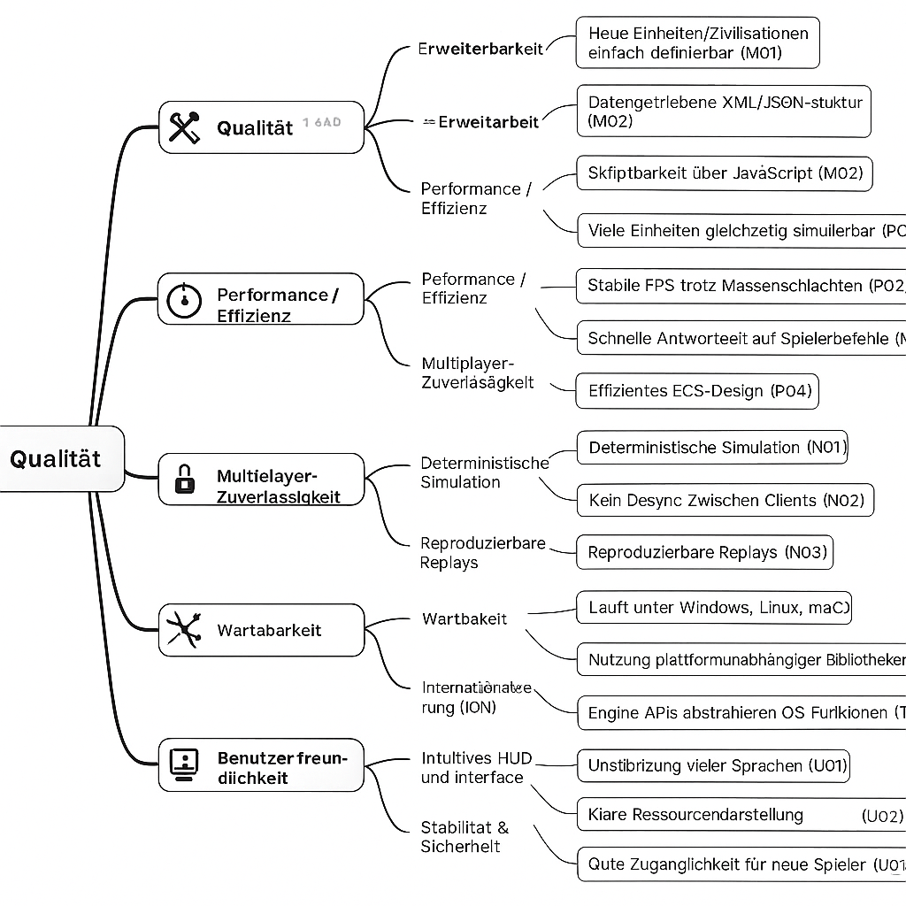
## 10.2 Qualitätsszenarien

Die Anfangsbuchstaben der Bezeichner (IDs) der Szenarien in der folgenden Tabelle stehen jeweils für das übergeordnete Qualitätsmerkmal,  M beispielsweise für Erweiterbarkeit. Die Bezeichner finden auch im Qualitätsbaum Verwendung. Nicht immer lassen sich die Szenarien eindeutig einem Merkmal zuordnen. Sie treten daher mitunter mehrmals im Qualitätsbaum auf.


| **Qualitätsbereich**             | **ID**  | **Qualitätsszenario (Stimulus, Kontext, Reaktion, Messkriterium)**                                                                                                                               |
| -------------------------------- | ------- | ------------------------------------------------------------------------------------------------------------------------------------------------------------------------------------------------ |
| **Erweiterbarkeit / Modding**    | **M01** | *Stimulus:* Modder fügt eine neue Zivilisation hinzu. *Kontext:* Keine Engine-Codeänderung. *Reaktion:* Engine lädt Templates. *Messkriterium:* Zivilisation erscheint im Menü und ist spielbar. |
|                                  | **M02** | *Stimulus:* Neue XML/JSON-Datei wird erstellt. *Kontext:* Spielstart. *Reaktion:* Engine liest Datei korrekt. *Messkriterium:* Einheit erscheint ohne Codeänderung im Spiel.                     |
|                                  | **M03** | *Stimulus:* Neues JavaScript-Script wird hinzugefügt. *Kontext:* Engine startet. *Reaktion:* Script läuft in Sandbox. *Messkriterium:* Funktioniert ohne Engine-Modifikation.                    |
| **Performance / Effizienz**      | **P01** | *Stimulus:* 400 Einheiten aktiv. *Kontext:* Standard-Hardware. *Reaktion:* Simulation verarbeitet alle. *Messkriterium:* Mindestens 30 FPS.                                                      |
|                                  | **P02** | *Stimulus:* Große Massenschlacht. *Kontext:* Viele Effekte. *Reaktion:* Rendering optimiert. *Messkriterium:* FPS bleibt > 25 FPS.                                                               |
|                                  | **P03** | *Stimulus:* Spielerbefehl wird ausgeführt. *Kontext:* Hochlastphase. *Reaktion:* Engine verarbeitet sofort. *Messkriterium:* < 150 ms Verzögerung.                                               |
|                                  | **P04** | *Stimulus:* Viele ECS-Komponenten verändern sich. *Kontext:* Simulations-Tick. *Reaktion:* ECS verarbeitet effizient. *Messkriterium:* Tick < 60 ms.                                             |
| **Multiplayer-Zuverlässigkeit**  | **N01** | *Stimulus:* Spieler senden gleichzeitig Befehle. *Kontext:* Lockstep. *Reaktion:* Gleichzeitige Tick-Ausführung. *Messkriterium:* GameState identisch bei allen Clients.                         |
|                                  | **N02** | *Stimulus:* Netzwerk-Lag. *Kontext:* Multiplayer-Spiel. *Reaktion:* Engine puffert Befehle. *Messkriterium:* Kein Desync.                                                                        |
|                                  | **N03** | *Stimulus:* Replay wird geladen. *Kontext:* Gespeicherte Befehle. *Reaktion:* Simulation rekonstruiert Match. *Messkriterium:* 100% Identisch zur Originalpartie.                                |
| **Wartbarkeit**                  | **W01** | *Stimulus:* Neues Subsystem wird hinzugefügt. *Kontext:* Modulare Architektur. *Reaktion:* Engine integriert über Interfaces. *Messkriterium:* Keine Änderungen an anderen Subsystemen nötig.    |
|                                  | **W02** | *Stimulus:* Entwickler schreibt Unit-Test. *Kontext:* Subsystem-isolierung. *Reaktion:* Test läuft ohne Abhängigkeiten. *Messkriterium:* Komponente isoliert testbar.                            |
|                                  | **W03** | *Stimulus:* Entwickler liest ECS-Komponenten. *Kontext:* Neue Fähigkeit. *Reaktion:* Leicht verständlich. *Messkriterium:* < 10 Minuten Einlernzeit.                                             |
| **Portabilität**                 | **T01** | *Stimulus:* Spielstart auf verschiedenen OS. *Kontext:* Gleiches Build. *Reaktion:* Engine initialisiert erfolgreich. *Messkriterium:* Keine OS-spezifischen Fehler.                             |
|                                  | **T02** | *Stimulus:* Update von OpenGL/SDL. *Kontext:* Engine nutzt abstrahierte APIs. *Reaktion:* Läuft ohne Änderungen. *Messkriterium:* Keine Inkompatibilitäten.                                      |
|                                  | **T03** | *Stimulus:* OS hat andere Datei-API. *Kontext:* Engine nutzt FS-Abstraktion. *Reaktion:* Einheitliches Verhalten. *Messkriterium:* Keine Plattformbugs.                                          |
| **Internationalisierung (I18N)** | **I01** | *Stimulus:* Sprachwechsel im Menü. *Kontext:* Spiel läuft. *Reaktion:* Texte laden neu. *Messkriterium:* < 1 Sekunde Reaktionszeit.                                                              |
|                                  | **I02** | *Stimulus:* Anzeige chinesischer Schrift. *Kontext:* GUI aktiv. *Reaktion:* Engine rendert Unicode korrekt. *Messkriterium:* Keine Darstellungsfehler.                                           |
|                                  | **I03** | *Stimulus:* Mod liefert neue .po-Dateien. *Kontext:* Spielstart. *Reaktion:* Engine lädt neue Strings. *Messkriterium:* Alle Texte korrekt sichtbar.                                             |
| **Benutzbarkeit**                | **U01** | *Stimulus:* Spieler wählt Einheit im Kampf. *Kontext:* Viele Entities. *Reaktion:* HUD aktualisiert schnell. *Messkriterium:* < 200 ms.                                                          |
|                                  | **U02** | *Stimulus:* Ressourcen ändern sich. *Kontext:* HUD aktiv. *Reaktion:* GUI aktualisiert Anzeige. *Messkriterium:* < 100 ms.                                                                       |
|                                  | **U03** | *Stimulus:* Neuer Spieler startet Tutorial. *Kontext:* Standard-GUI. *Reaktion:* Eindeutige Anleitungen. *Messkriterium:* Spieler versteht Grundlagen in < 5 Minuten.                            |
| **Stabilität & Sicherheit**      | **S01** | *Stimulus:* JavaScript-Mod enthält Fehler. *Kontext:* Engine lädt Mods. *Reaktion:* Sandbox blockiert fehlerhaften Code. *Messkriterium:* Kein Absturz.                                          |
|                                  | **S02** | *Stimulus:* Textur fehlt. *Kontext:* Map-Ladevorgang. *Reaktion:* Engine loggt Warnung. *Messkriterium:* Spiel läuft weiter.                                                                     |
|                                  | **S03** | *Stimulus:* XML ist ungültig. *Kontext:* Spielstart. *Reaktion:* Engine meldet Fehler. *Messkriterium:* Engine bleibt stabil.                                                                    |


# Risiken und technische Schulden 

Die folgende Tabelle gibt einen strukturierten Überblick über die zentralen technischen und architektonischen Risiken von 0 A.D.

| **Risiko-ID** | **Beschreibung**                                                                                              |
| ------------- | ------------------------------------------------------------------------------------------------------------- |
| **R01**       | Hohe Komplexität des ECS-Systems erschwert Debugging und führt zu potenziell unerwarteten Logikfehlern.       |
| **R02**       | Gefahr von Desynchronisationen im Multiplayer aufgrund des deterministischen Lockstep-Modells.                |
| **R03**       | Performance-Probleme bei großen Massenschlachten durch hohe CPU-Last (Pathfinding, Kampf, Sichtweite).        |
| **R04**       | Abhängigkeit von älteren Technologien wie OpenGL oder SpiderMonkey kann zukünftige Wartung erschweren.        |
| **R05**       | Fehlerhafte oder inkompatible Mods können Instabilität verursachen oder Spielabläufe stören.                  |
| **R06**       | Große und komplexe Codebasis (C++ + JS) führt zu hoher Einarbeitungszeit für neue Entwickler.                 |
| **R07**       | Plattformabhängige Unterschiede zwischen Windows, Linux und macOS können OS-spezifische Bugs verursachen.     |
| **R08**       | Große Asset-Dateien führen zu langen Ladezeiten und hohem Speicherverbrauch.                                  |
| **R09**       | KI (Petra Bot) benötigt viel CPU-Leistung, was im Spiel zu FPS-Einbrüchen führen kann.                        |
| **R10**       | Komplexität der deterministischen Simulation macht bestimmte Bugs schwer reproduzierbar und schwer zu finden. |


| **Technische Schuld** | **Beschreibung**                                     |
| --------------------- | ---------------------------------------------------- |
| **TS01**              | Veraltete SpiderMonkey JS-Engine → erschwert Updates |
| **TS02**              | Viele Legacy-C++-Module ohne klare Abgrenzung        |
| **TS03**              | Fehlende vollständige Testabdeckung                  |
| **TS04**              | Inkompatible oder alte Assets im Modding-System      |
| **TS05**              | Nicht vollständig dokumentierte ECS-Komponenten      |


# Glossar 
## 12.1 Einleitung

Das folgende Glossar erklärt zentrale Begriffe aus der Spielwelt und der technischen Architektur von 0 A.D..
Es umfasst sowohl Bezeichnungen aus dem Bereich historischer Echtzeitstrategiespiele (z. B. Einheiten, Gebäude, Ressourcen) als auch technische Konzepte aus der Engine-, Simulations- und Rendering-Architektur.

Die Definitionen und Abbildungen sollen das Verständnis der Spielmechanik und der Systemarchitektur erleichtern und dienen als Nachschlagewerk für die folgenden Kapitel.

### Einheitentypen


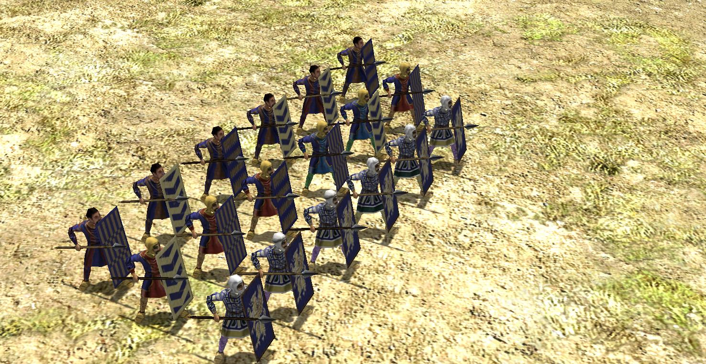

**Spearman** – *Nahkampfeinheit, effektiv gegen Kavallerie.*


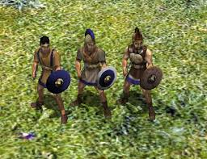

**Swordsman** – *Schwer gepanzerte Infanterie, stark im Nahkampf.*


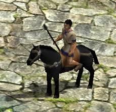

**Cavalry Spearman** – *Schnelle Anti-Infanterie-Einheit.*


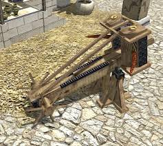

**Catapult** – *Effektiv gegen Gebäude.*


**Hero Unit** – *Einzigartige Einheiten mit Auren und Spezialboni.*

## Gebäudetypen


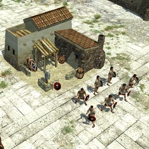

**Civic Center** – *Hauptgebäude, erzeugt Bürger und expandiert das Territorium.*


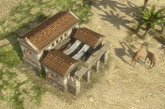

**House** – *Erhöht Bevölkerungslimit.*


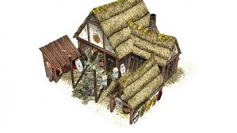

**Barracks** – *Rekrutiert Infanterie.*


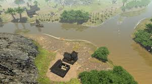

**Fortress** – *Starkes Verteidigungsgebäude, erzeugt Elite-Einheiten.*


## Ressourcen

Nahrung


Gesammelt durch Felder, Beeren, Tiere.

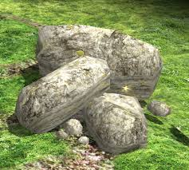
Benötigt für Mauern, Festungen.


## 12.2 Begriffe

| **Begriff**                        | **Definition**                                                                                                                                               |
| ---------------------------------- | ------------------------------------------------------------------------------------------------------------------------------------------------------------ |
| **0 A.D.**                         | Open-Source-Echtzeitstrategiespiel, entwickelt von Wildfire Games. Ähnelt Age of Empires, aber ist vollständig modbar und community-getrieben.               |
| **Engine Core**                    | Zentrales Steuersystem der Engine. Verwaltet Hauptspielschleife, Ereignisse, Ressourcen, Timing und Kommunikation zwischen Subsystemen.                      |
| **ECS (Entity-Component-System)**  | Architekturmodell, das Spielobjekte (Entities) in reine Daten (Components) und Logikmodule (Systems) aufteilt. Garantiert hohe Performance und Flexibilität. |
| **Entity (Entität)**               | Ein Spielobjekt im ECS-System, z. B. Einheit, Gebäude, Projektil. Besteht aus einer Sammlung von Komponenten.                                                |
| **Component (Komponente)**         | Reiner Datenbehälter, der eine bestimmte Eigenschaft einer Entity beschreibt, z. B. Position, Gesundheit, Angriffswerte.                                     |
| **System**                         | Logikmodul, das auf bestimmte Komponenten angewendet wird. Beispiele: MovementSystem, CombatSystem, ProductionSystem.                                        |
| **Simulation Tick**                | Ein Logik-Update-Schritt der Simulation, in dem Commands verarbeitet und der Spielzustand aktualisiert wird.                                                 |
| **Lockstep-Modell**                | Multiplayer-Synchronisationsmethode, bei der alle Clients dieselben Befehle verarbeiten und so einen identischen Spielzustand garantieren.                   |
| **Desync (Desynchronisation)**     | Zustand, in dem Multiplayer-Clients unterschiedliche Simulationsergebnisse berechnen und das Spiel inkonsistent wird.                                        |
| **Rendering Subsystem**            | Subsystem zur visuellen Darstellung der Spielwelt (OpenGL-basiert). Rendert Terrain, Einheiten, Objekte, Effekte.                                            |
| **Audio Subsystem**                | Subsystem für Soundeffekte und Musik. Nutzt OpenAL für 3D-Audio.                                                                                             |
| **GUI (Graphical User Interface)** | Benutzeroberfläche des Spiels: Menüs, HUD, Panels, Tooltips, Minimap. Basierend auf XML + JavaScript.                                                        |
| **Mod / Modding**                  | Vom Benutzer erstellte Inhalte (Einheiten, Zivilisationen, Karten, Regeln, Skripte). In *0 A.D.* über XML/JSON + JS definiert.                               |
| **Template**                       | XML-Datei, die Eigenschaften einer Einheit, eines Gebäudes oder Objekts beschreibt. Datengetriebener Ansatz.                                                 |
| **Replay**                         | Aufzeichnung eines vollständigen Spiels in Form von Befehlslisten zur späteren Wiedergabe oder Fehlersuche.                                                  |
| **Atlas Editor**                   | Offizieller Karten- und Szenarieneditor von *0 A.D.*. Ermöglicht das Erstellen von Maps ohne Programmierkenntnisse.                                          |
| **Scripting API**                  | Schnittstelle zwischen JavaScript und Engine Core. Ermöglicht Zugriff auf Engine-Funktionen (Commands, Daten, GUI).                                          |
| **OpenGL**                         | Cross-Plattform-Grafik-API, die für das Rendering in *0 A.D.* verwendet wird.                                                                                |
| **OpenAL**                         | Cross-Plattform-Audio-API zur Wiedergabe von 3D-Sound.                                                                                                       |
| **ENet**                           | Netzwerkbibliothek für zuverlässige UDP-Kommunikation, welche für Multiplayer verwendet wird.                                                                |
| **Pathfinding**                    | Algorithmus zur Berechnung von Einheitenbewegungen zum Zielpunkt. In *0 A.D.* oft ein Performance-Bottleneck.                                                |
| **LOD (Level of Detail)**          | Technik zur Darstellung von entfernten Objekten mit geringerer Detailtiefe, um Performance zu verbessern.                                                    |
| **Sandboxing**                     | Sicherheitsmechanismus, der verhindert, dass modifizierte Scripts das System beschädigen können.                                                             |
| **Tickrate**                       | Frequenz, mit der die Simulation pro Sekunde aktualisiert wird.                                                                                              |
| **HUD (Heads-Up Display)**         | In-Game-Benutzeroberfläche, die Ressourcen, Einheiteninfos und Minimap anzeigt.                                                                              |
